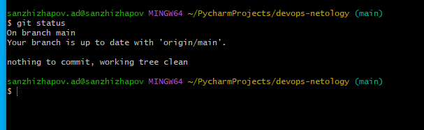
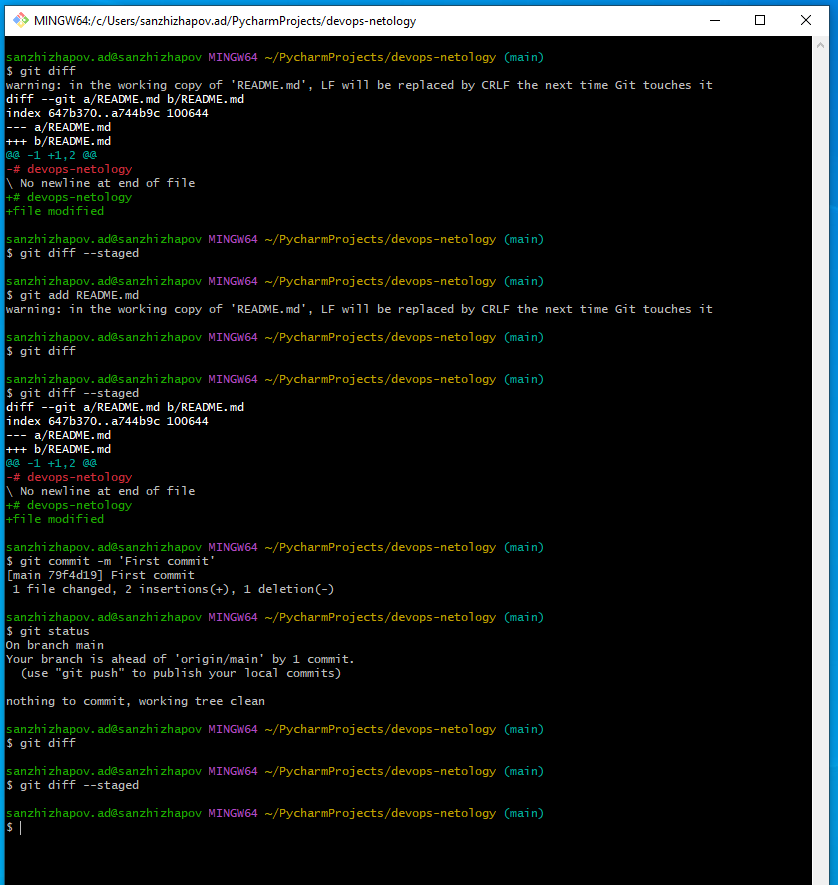
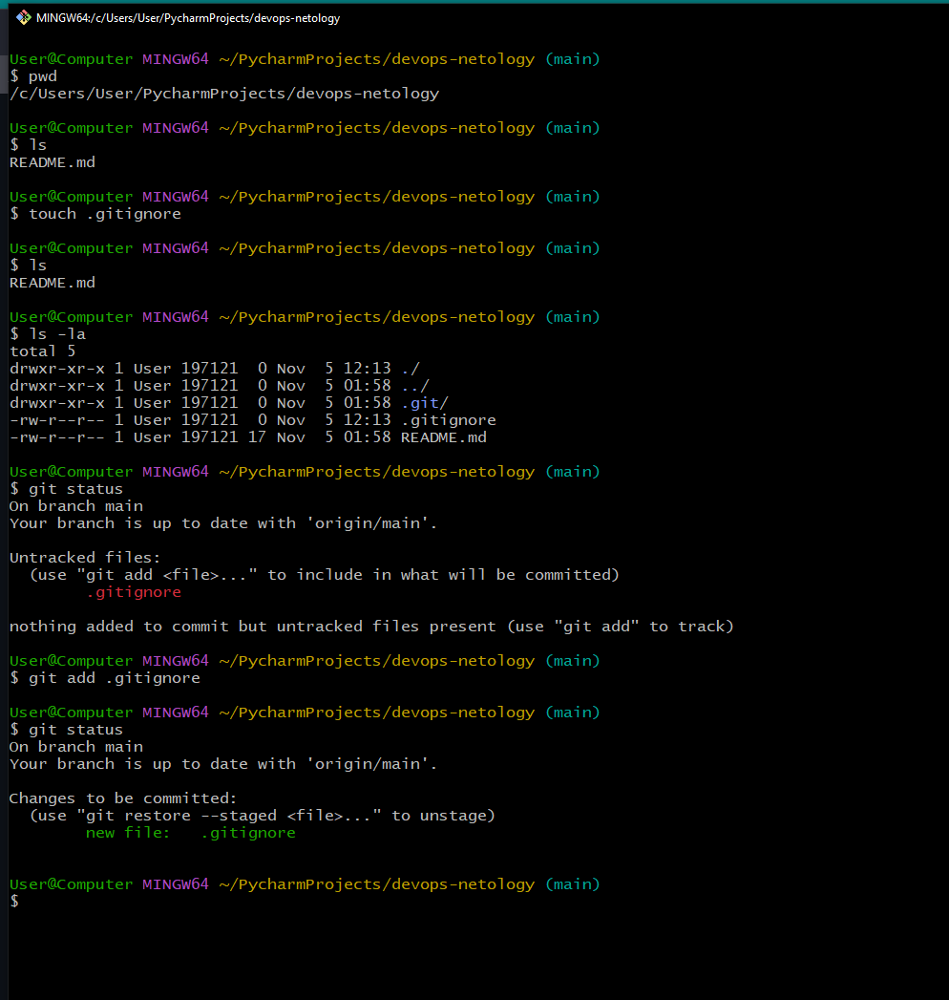
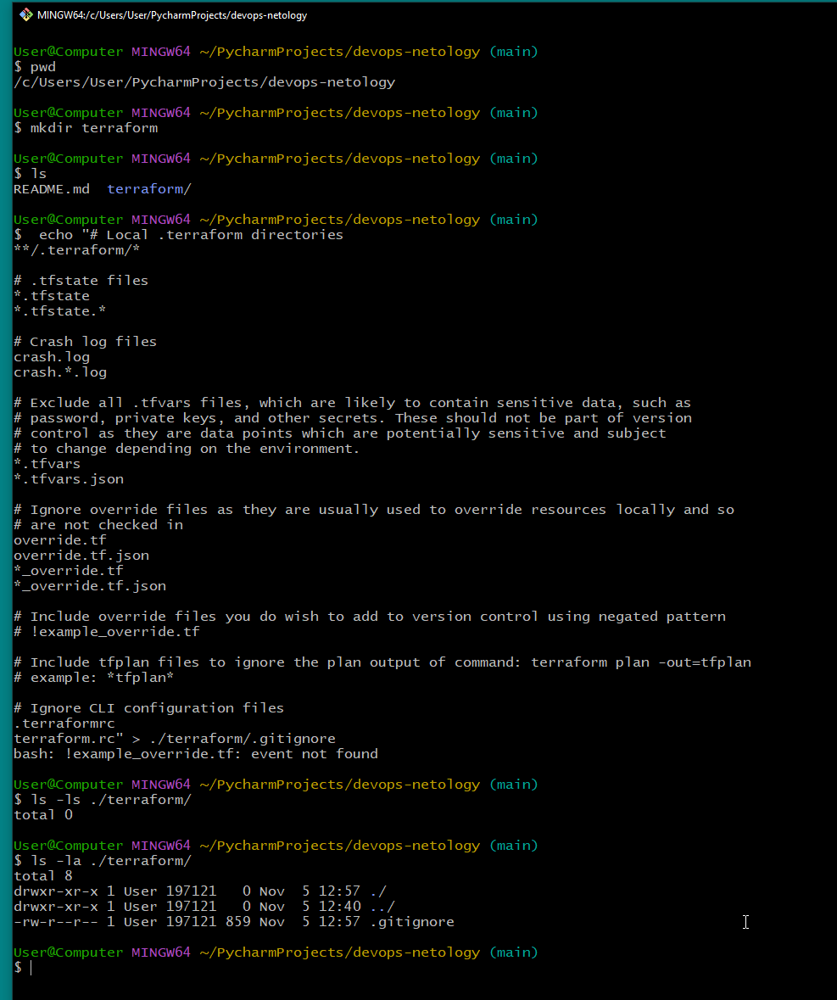
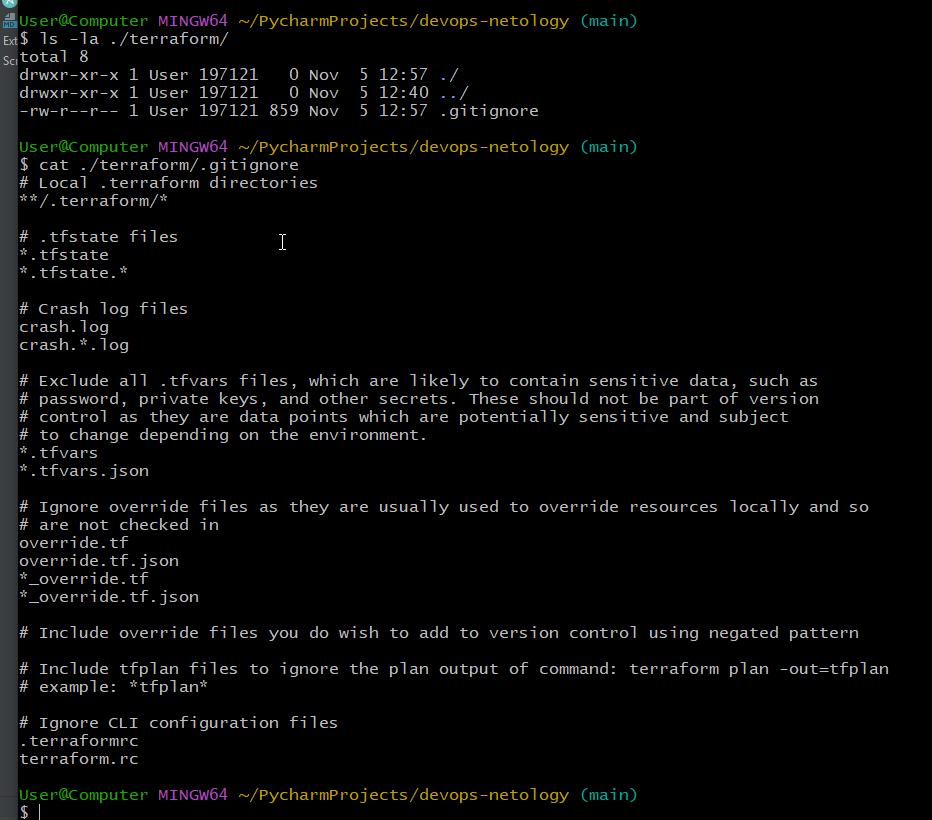
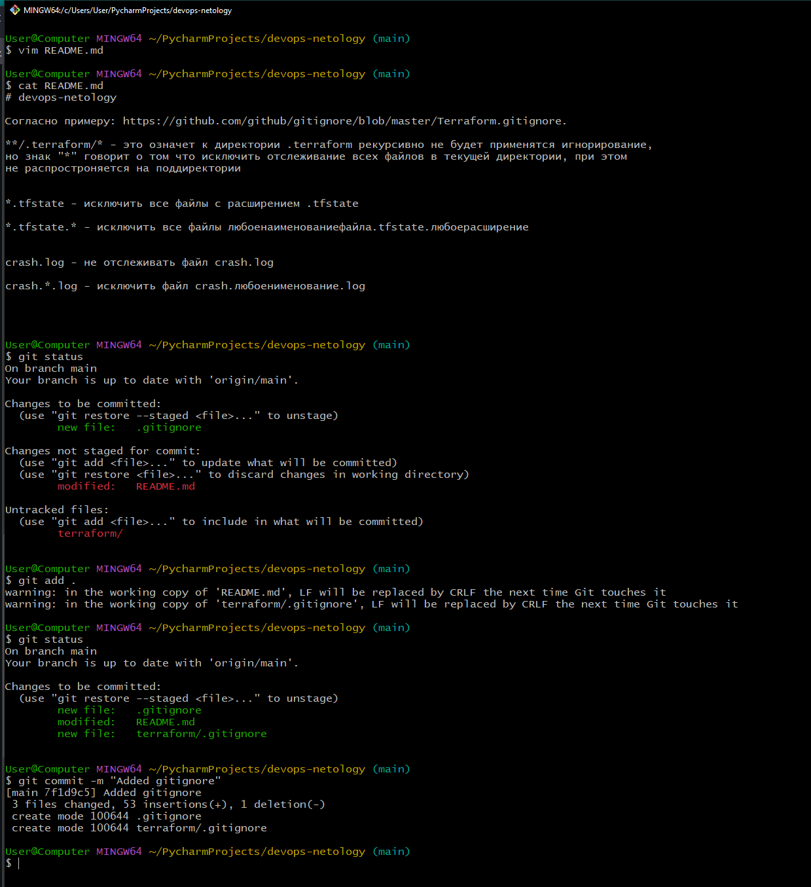

# Arsalan DEVOPS-24
## 2.1. Системы контроля версий

### Задание 1. Создать и настроить репозиторий для дальнейшей работы на курсе.

1. Зарегистрируйте аккаунт на https://github.com/ (если вы предпочитаете другое хранилище для репозитория, можно использовать его).
    
2. Создайте публичный репозиторий, который будете использовать дальше на протяжении всего курса, желательное название devops-netology. Обязательно поставьте галочку Initialize this repository with a README.
    
3. Создать авторизационный токен для клонирования репозитория
    
4. Склонируйте репозиторий, используя https протокол (git clone ...)
    
5. Перейдите в каталог с клоном репозитория (cd devops-netology)
    
6. Произведите первоначальную настройку git, указав свое настоящее имя и email (git config --global user.name и git config --global user.email).

    

7. Выполните команду git status и запомните результат.      
    
8. Отредактируйте файл README.md любым удобным способом, тем самым переведя файл в состояние Modified.
    
9. Еще раз выполните git status и продолжайте проверять вывод этой команды после каждого последующего шага.
    

10 - 14. Выполнение пунктов 10 по 14.
    

### Создание файлов .gitignore и второго коммита:

15. Создайте файл .gitignore (обратите внимание на точку в начале файла), проверьте его статус сразу после создания.
Добавьте файл .gitignore в следующий коммит (git add...)
    
16. На одном из следующих блоков мы будем изучать Terraform, давайте сразу же создадим соотвествующий каталог terraform и внутри этого каталога файл .gitignore по этому примеру: https://github.com/github/gitignore/blob/master/Terraform.gitignore.
    
    
17. В файле README.md опишите своими словами какие файлы будут проигнорированы в будущем благодаря добавленному .gitignore.
Закоммитьте все новые и измененные файлы. Комментарий к коммиту должен быть Added gitignore.
    

### Эксперимент с удалением и перемещением файлов (третий и четвертый коммит)

18. 