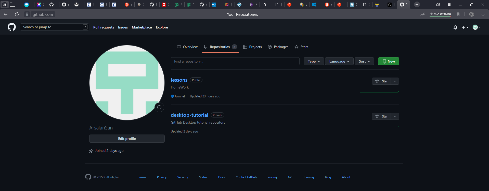
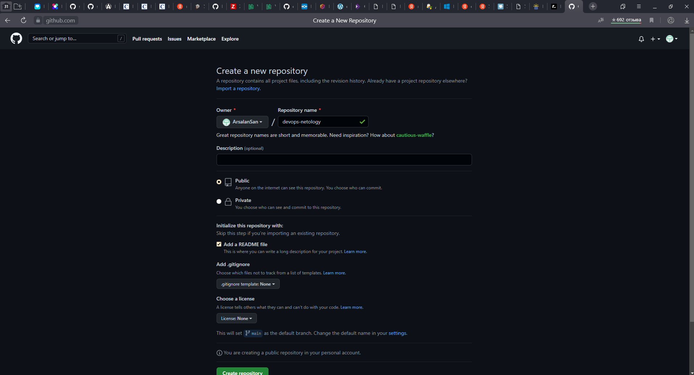
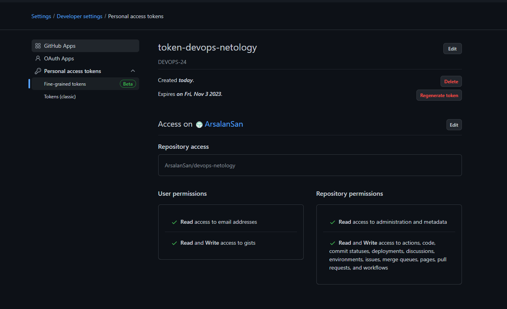
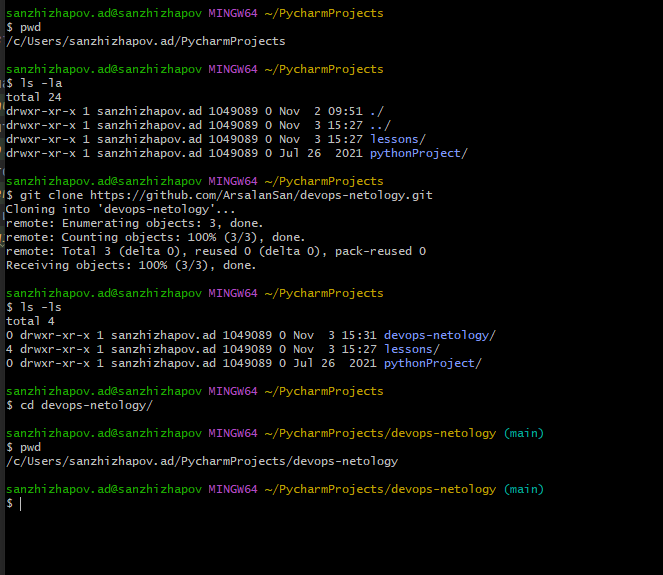
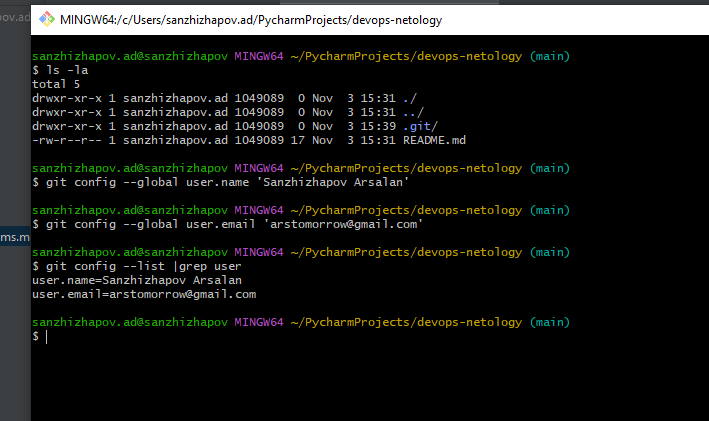

# Arsalan DEVOPS-24
## 2.1. Системы контроля версий

### Задание 1. Создать и настроить репозиторий для дальнейшей работы на курсе.

1. Зарегистрируйте аккаунт на https://github.com/ (если вы предпочитаете другое хранилище для репозитория, можно использовать его).
    
2. Создайте публичный репозиторий, который будете использовать дальше на протяжении всего курса, желательное название devops-netology. Обязательно поставьте галочку Initialize this repository with a README.
    
3. Создать авторизационный токен для клонирования репозитория
    
4. Склонируйте репозиторий, используя https протокол (git clone ...)
    
5. Перейдите в каталог с клоном репозитория (cd devops-netology)
    
6. Произведите первоначальную настройку git, указав свое настоящее имя и email (git config --global user.name и git config --global user.email johndoe@example.com).
    