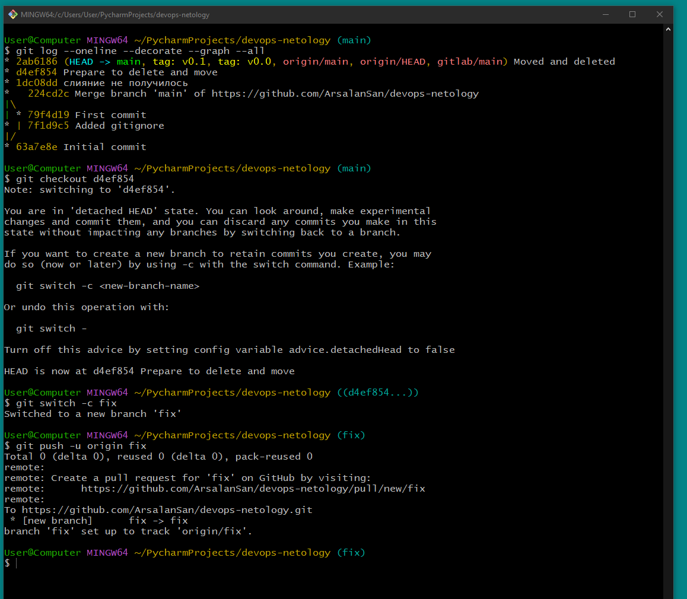
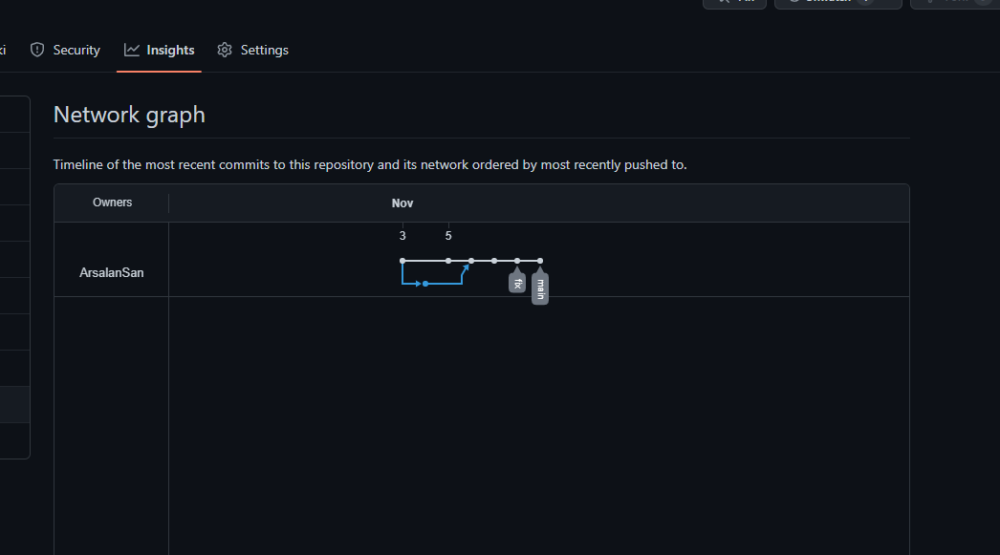
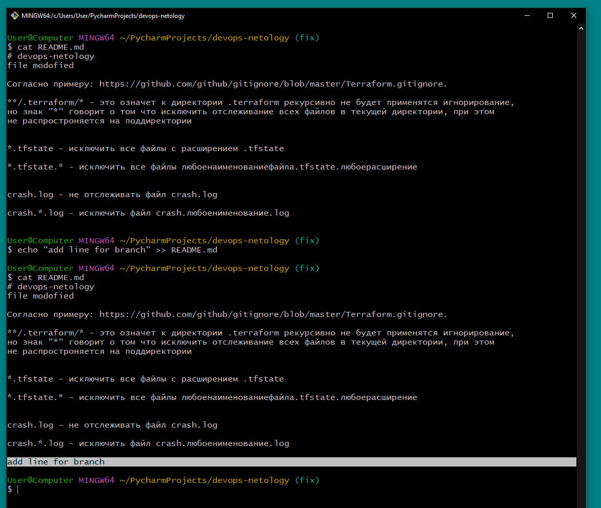
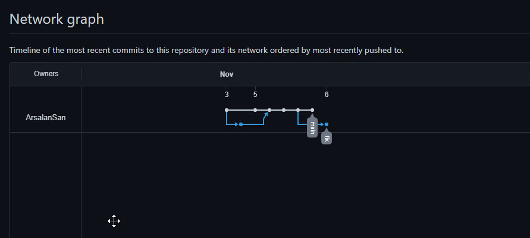
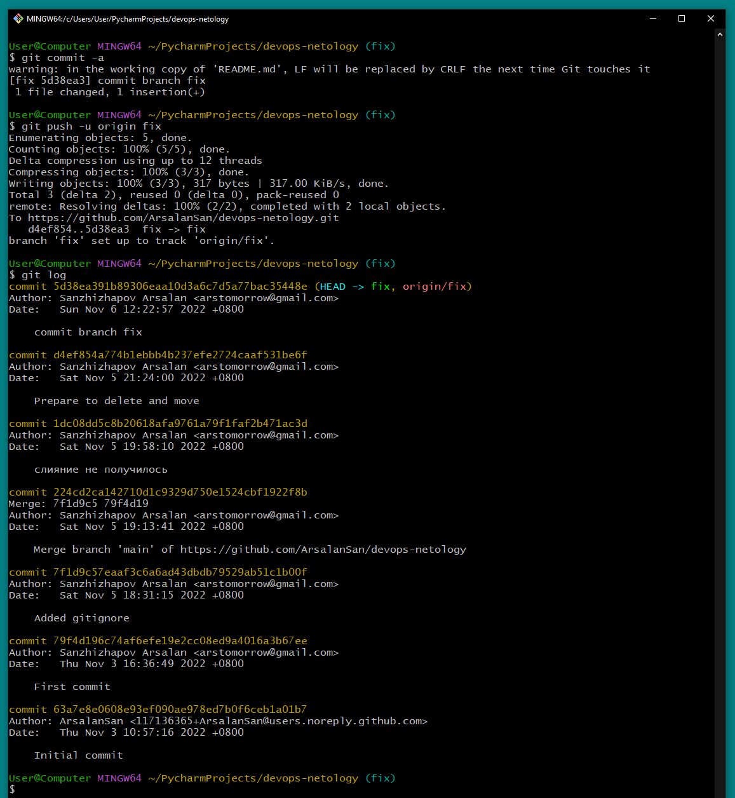
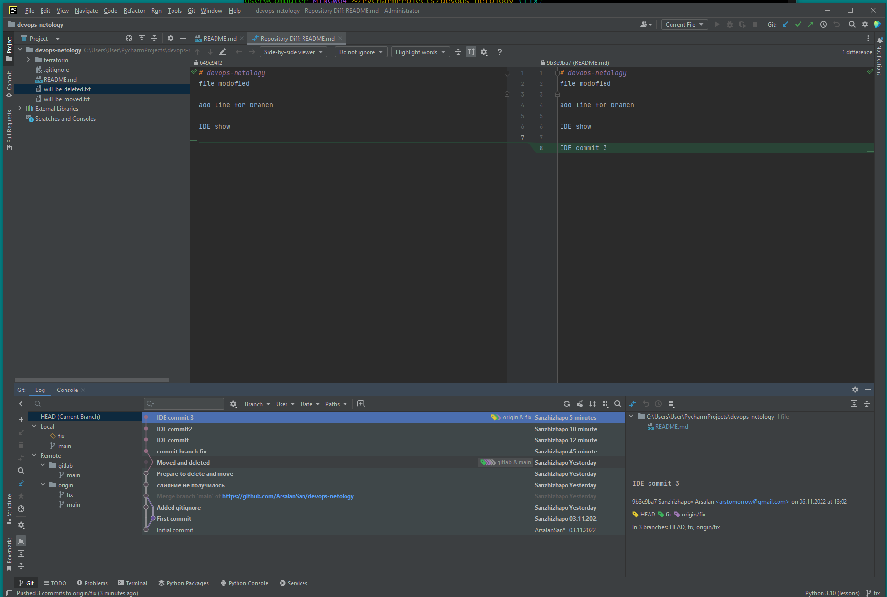

# Arsalan DEVOPS-24

## Результата выполнения задания: [github](https://github.com/ArsalanSan/devops-netology.git) [gitlab](https://gitlab.com/ArsalanSan/devops-netology.git)

### Задание №1. Знакомимся с GitLab (обязательно) и bitbucket (по желанию)

1. 
2. 
3. 

### Задание №2. Теги

### Задание №3. Ветки

### Задание №4. Упрощаем себе жизнь

