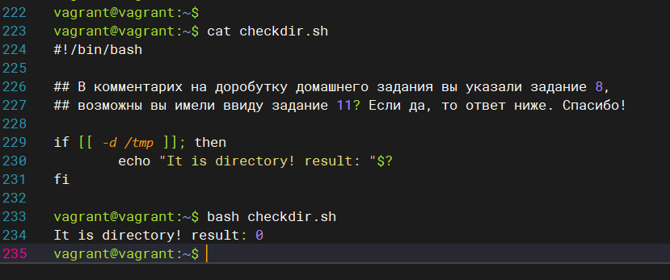

### 3.1. Работа в терминале, лекция 1
1. Установите средство виртуализации Oracle VirtualBox. 

2. Установите средство автоматизации Hashicorp Vagrant.

3. В вашем основном окружении подготовьте удобный для дальнейшей работы терминал

4. С помощью базового файла конфигурации запустите Ubuntu 20.04 в VirtualBox посредством Vagrant

5. Ознакомьтесь с графическим интерфейсом VirtualBox, посмотрите как выглядит виртуальная машина, которую создал для вас Vagrant, какие аппаратные ресурсы ей выделены. Какие ресурсы выделены по-умолчанию?

6. Ознакомьтесь с возможностями конфигурации VirtualBox через Vagrantfile: документация. Как добавить оперативной памяти или ресурсов процессора виртуальной машине?

7. Команда vagrant ssh из директории, в которой содержится Vagrantfile, позволит вам оказаться внутри виртуальной машины без каких-либо дополнительных настроек. Попрактикуйтесь в выполнении обсуждаемых команд в терминале Ubuntu.

8. Ознакомиться с разделами man bash, почитать о настройках самого bash

    какой переменной можно задать длину журнала history, и на какой строчке manual это описывается?
    что делает директива ignoreboth в bash?

9. Используется в синтаксисе bash при написании фукции, массива.
В целом расширяет возможности стандартных команд linux.

Примеры: 

10. Основываясь на предыдущем вопросе, как создать однократным вызовом touch 100000 файлов? А получилось ли создать 300000?

11. В man bash поищите по /\[\[. Что делает конструкция [[ -d /tmp ]]

12. Основываясь на знаниях о просмотре текущих (например, PATH) и установке новых переменных; командах, которые мы рассматривали, добейтесь в выводе type -a bash в виртуальной машине наличия первым пунктом в списке

13. Чем отличается планирование команд с помощью batch и at?

<ul>
  <li><b>at</b> это утилита командной строки, которая позволяет вам планировать выполнение команд в определенное время. Задания, созданные с помощью at , выполняются только один раз.</li>
  <li><b>batch</b> планирует задания и выполняет их в пакетной очереди, если позволяет уровень загрузки системы. По умолчанию задания выполняются, когда средняя загрузка системы ниже 1,5. Значение нагрузки можно указать при вызове демона atd . Если средняя загрузка системы выше указанной, задания будут ждать в очереди.</li>
</ul>

14.Завершите работу виртуальной машины чтобы не расходовать ресурсы компьютера и/или батарею ноутбука.
