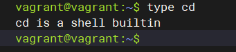
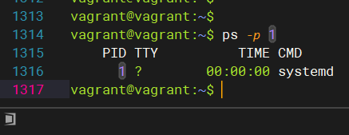

## Arsalan DEVOPS-24
### 3.2. Работа в терминале, лекция 2

1. Какого типа команда cd? Попробуйте объяснить, почему она именно такого типа; опишите ход своих мыслей, если считаете что она могла бы быть другого типа.

   

   <code>cd - это встроенная команда оболочки.</code>
   <blockquote>..chdir корректно изменила текущий каталог процесса, созданного для ее выполнения, но этот процесс быстро завершился и не оказал никакого влияния на его родительскую оболочку! Необходимо было сделать chdir специальной командой, выполняемой внутри оболочки.</blockquote>
   <b>Источник:</b> Dennis M. Ritchie, “The Evolution of the Unix Time-sharing System”, AT&T Bell Laboratories Technical Journal 63(6), Part 2, Oct. 1984, pp.1577–93
2. Какая альтернатива без pipe команде grep <some_string> <some_file> | wc -l?

    <code>grep -c <some_string> <some_file></code>
3. Какой процесс с PID 1 является родителем для всех процессов в вашей виртуальной машине Ubuntu 20.04?

   <code>systemd — набор базовых компонентов Linux-системы. Представляет собой менеджер системы и служб, который выполняется как процесс с PID 1 и запускает остальную часть системы</code>
4. Как будет выглядеть команда, которая перенаправит вывод stderr ls на другую сессию терминала?
   
<code>ls /etc 2>/dev/pts/2</code>

5. Получится ли одновременно передать команде файл на stdin и вывести ее stdout в другой файл? Приведите работающий пример.
