## Arsalan DEVOPS-24
### 3.2. Работа в терминале, лекция 2

1. Какого типа команда cd? Попробуйте объяснить, почему она именно такого типа; опишите ход своих мыслей, если считаете что она могла бы быть другого типа.

   

   <code>cd - это встроенная команда оболочки.</code>
   <blockquote>..chdir корректно изменила текущий каталог процесса, созданного для ее выполнения, но этот процесс быстро завершился и не оказал никакого влияния на его родительскую оболочку! Необходимо было сделать chdir специальной командой, выполняемой внутри оболочки.</blockquote>
   <b>Источник:</b> Dennis M. Ritchie, “The Evolution of the Unix Time-sharing System”, AT&T Bell Laboratories Technical Journal 63(6), Part 2, Oct. 1984, pp.1577–93
2. Какая альтернатива без pipe команде grep <some_string> <some_file> | wc -l?

    <code>grep -c <some_string> <some_file></code>
3. Какой процесс с PID 1 является родителем для всех процессов в вашей виртуальной машине Ubuntu 20.04?

   <code>systemd — набор базовых компонентов Linux-системы. Представляет собой менеджер системы и служб, который выполняется как процесс с PID 1 и запускает остальную часть системы</code>
4. Как будет выглядеть команда, которая перенаправит вывод stderr ls на другую сессию терминала?
   
<code>ls /etc 2>/dev/pts/2</code>

5. Получится ли одновременно передать команде файл на stdin и вывести ее stdout в другой файл? Приведите работающий пример.

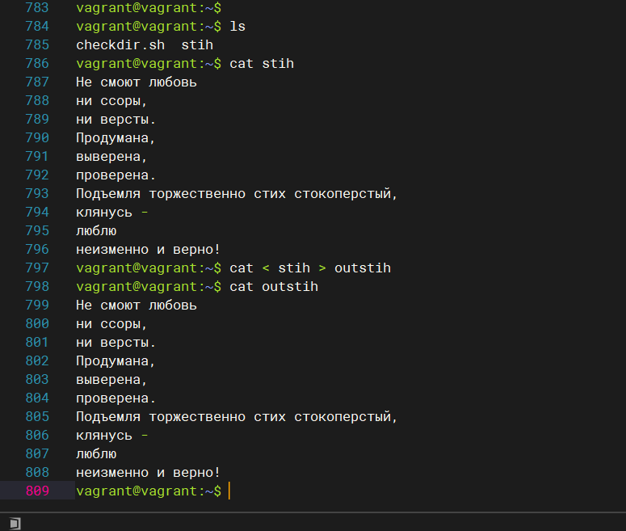
6. Получится ли вывести находясь в графическом режиме данные из PTY в какой-либо из эмуляторов TTY? Сможете ли вы наблюдать выводимые данные?
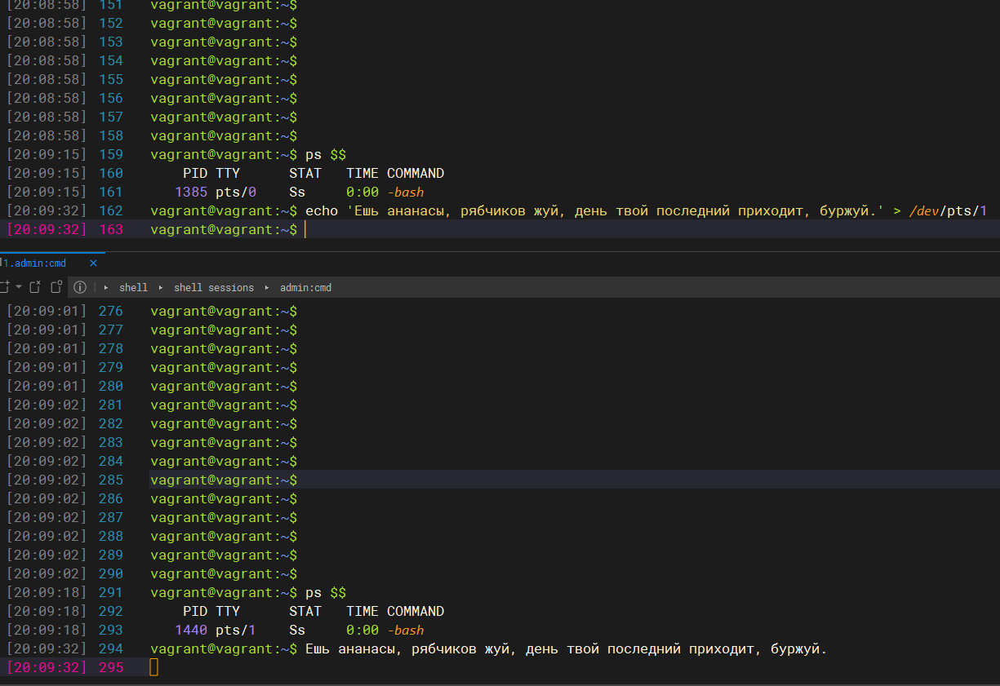
7. Выполните команду bash 5>&1. К чему она приведет? Что будет, если вы выполните echo netology > /proc/$$/fd/5? Почему так происходит?
   <code>Запускает оболочку bash с дескрипторным значением 5 и перенаправляет его в стандарный вывод(stdout), при этом создает дочерний процесс(PID).</code>
   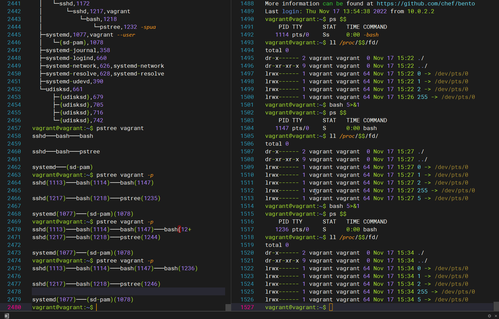
   <code>echo netology > /proc/$$/fd/5 выведет в терминал текст "netology", потому что происходит перенаправление на стандартный вывод в текущем процессе(PID)</code>
   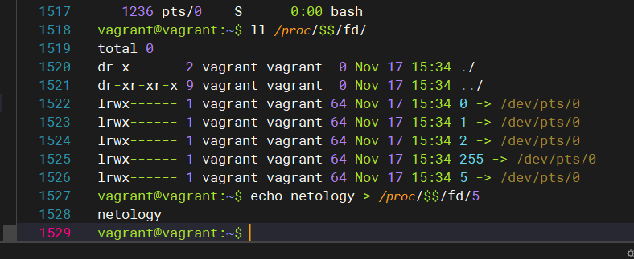

8. Получится ли в качестве входного потока для pipe использовать только stderr команды, не потеряв при этом отображение stdout на pty? Напоминаем: по умолчанию через pipe передается только stdout команды слева от | на stdin команды справа. Это можно сделать, поменяв стандартные потоки местами через промежуточный новый дескриптор, который вы научились создавать в предыдущем вопросе

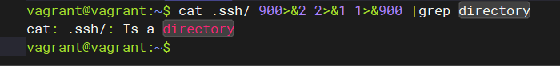
9. Что выведет команда cat /proc/$$/environ? Как еще можно получить аналогичный по содержанию вывод?
<code>
   Содержит переменные окружения, заданные на этапе запуска процесса, в конкретно случаи выводит переменные окружения текущего процесса.
   Аналогичный вывод можно с помощью команд env или printenv
</code>

10. Используя man, опишите что доступно по адресам /proc/<PID>/cmdline, /proc/<PID>/exe.
   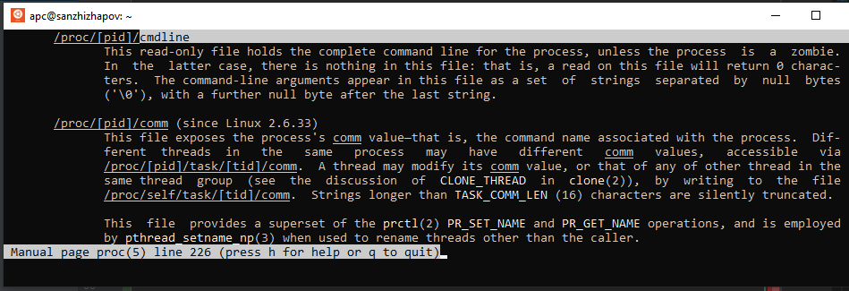
   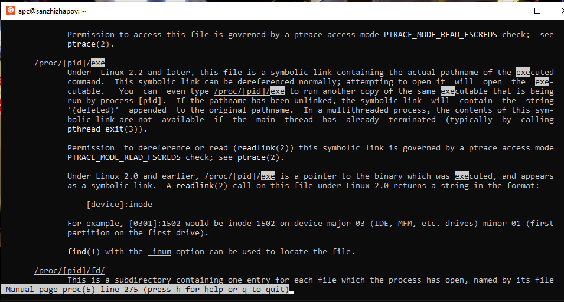

<code>
   /proc/<PID>/cmdline - содержит команду с помощью которой был запущен процесс(PID), а также переданные ей параметры.
   Параметры отображаются, виде набора строк, разделенных нулевыми байтами ('\0').
</code>

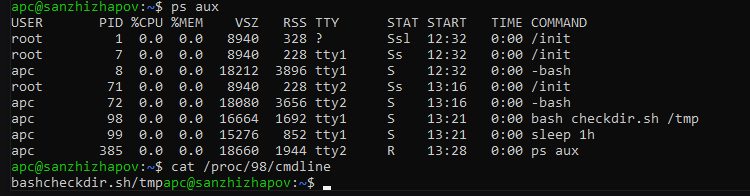

<code>
   /proc/<PID>/exe - показывает ссылку на бинарник конкретного процесса(PID)
</code>

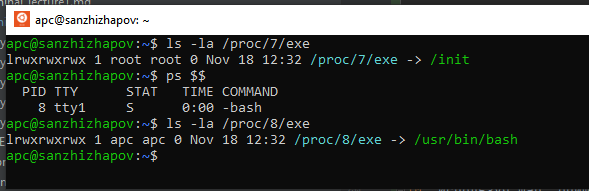

11. Узнайте, какую наиболее старшую версию набора инструкций SSE поддерживает ваш процессор с помощью /proc/cpuinfo.

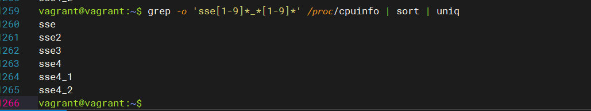

12. При открытии нового окна терминала и vagrant ssh создается новая сессия и выделяется pty. Это можно подтвердить командой tty
    
    <code> 
    man ssh нашел параметр '-t', каторый принудительно создает псевдотерминал, пытался подключится с этим параметром но соединение закрывается
    </code>
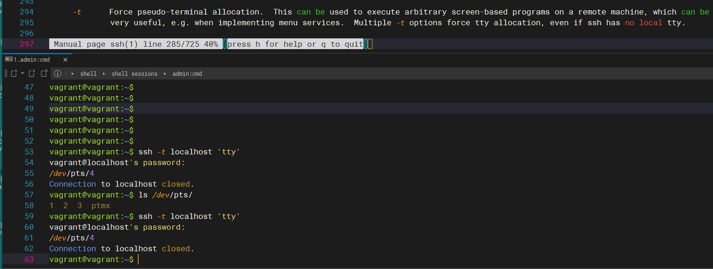

13. Бывает, что есть необходимость переместить запущенный процесс из одной сессии в другую. Попробуйте сделать это, воспользовавшись reptyr. Например, так можно перенести в screen процесс, который вы запустили по ошибке в обычной SSH-сессии.

    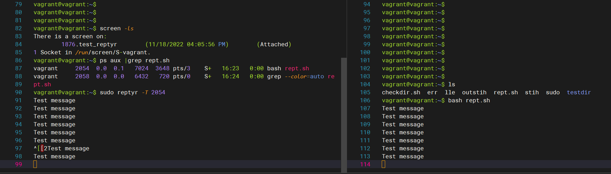

14. sudo echo string > /root/new_file не даст выполнить перенаправление под обычным пользователем, так как перенаправлением занимается процесс shell'а, который запущен без sudo под вашим пользователем. Для решения данной проблемы можно использовать конструкцию echo string | sudo tee /root/new_file. Узнайте что делает команда tee и почему в отличие от sudo echo команда с sudo tee будет работать.

    <code>
    Команда tee читает из стандартного ввода и записывает как в стандартный вывод, так и в один или несколько файлов одновременно.
    Что бы записать данные в файл требуется повышение прав,при такой ситуации echo не отработает, а tee позволит записать данные запустив через sudo   
    </code>

