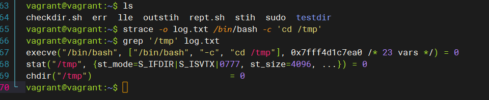
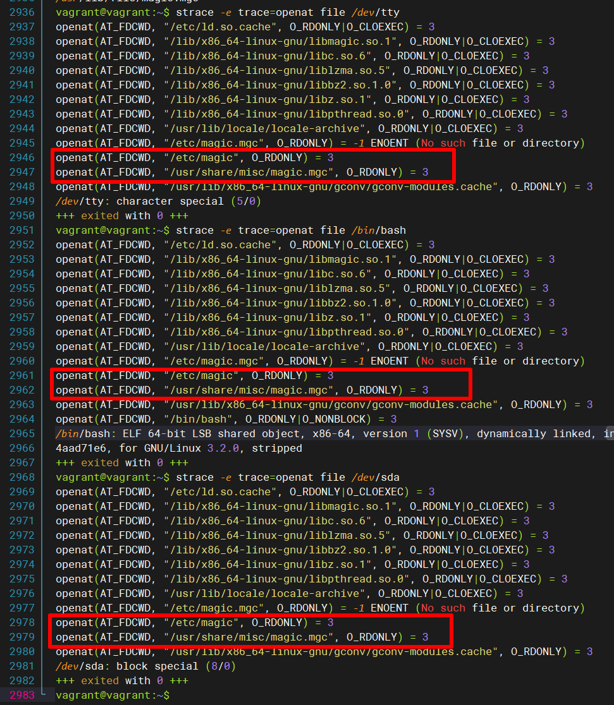
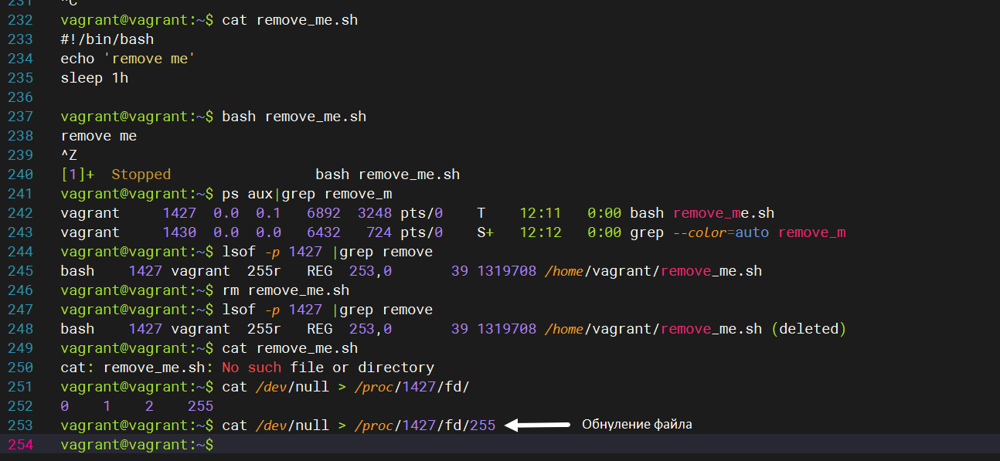
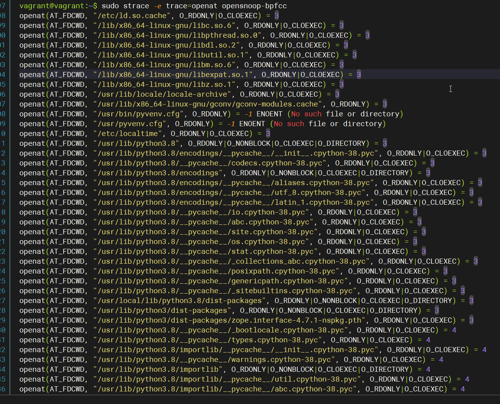
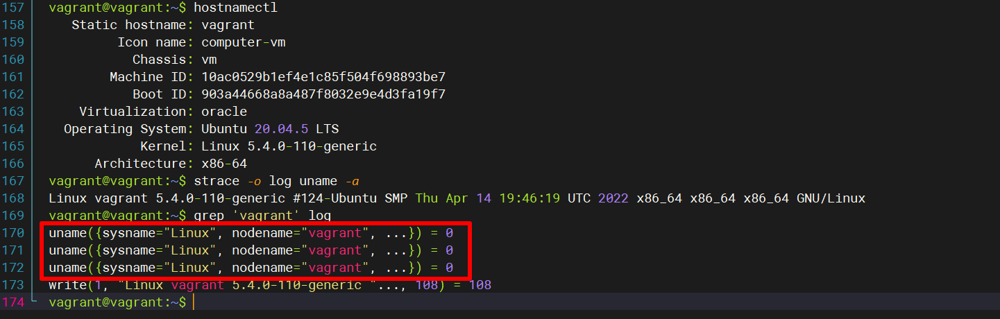
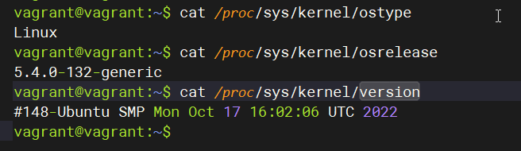
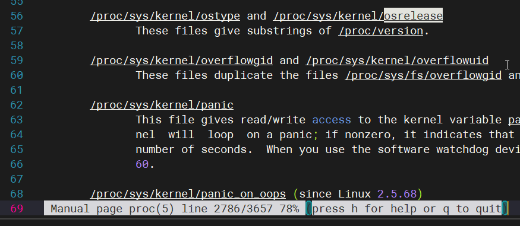

## Arsalan DEVOPS-24
### 3.3. Операционные системы, лекция 1

1. Какой системный вызов делает команда cd? В прошлом ДЗ мы выяснили, что cd не является самостоятельной программой, это shell builtin, поэтому запустить strace непосредственно на cd не получится. Тем не менее, вы можете запустить strace на /bin/bash -c 'cd /tmp'. В этом случае вы увидите полный список системных вызовов, которые делает сам bash при старте. Вам нужно найти тот единственный, который относится именно к cd.

<code>Выгрузил все системные вызовы в файл,утилитой grep нашел в выгруженном файле те системные вызовы которые обращались к директории '/tmp'. К директории обращались 3 системных вызова - execve,stat и chdir. execve - выполняет программу, stat - считывает состояние файла, chdir как раз относится именно к cd, изменяет рабочий каталог  </code>

2. Попробуйте использовать команду file на объекты разных типов на файловой системе. Используя strace выясните, где находится база данных file на основании которой она делает свои догадки.

<code>По моему анализу выходит два файла /etc/magic и /usr/share/misc/magic.mgc</code>

3. Предположим, приложение пишет лог в текстовый файл. Этот файл оказался удален (deleted в lsof), однако возможности сигналом сказать приложению переоткрыть файлы или просто перезапустить приложение – нет. Так как приложение продолжает писать в удаленный файл, место на диске постепенно заканчивается. Основываясь на знаниях о перенаправлении потоков предложите способ обнуления открытого удаленного файла (чтобы освободить место на файловой системе).

5. На какие файлы вы увидели вызовы группы open за первую секунду работы утилиты? Воспользуйтесь пакетом bpfcc-tools для Ubuntu 20.04.

 <code> В основном библиотеки, конфигурационные файлы, python скрипты </code>

6.Какой системный вызов использует uname -a? Приведите цитату из man по этому системному вызову, где описывается альтернативное местоположение в /proc, где можно узнать версию ядра и релиз ОС.

