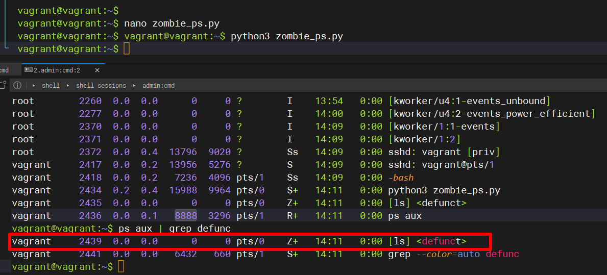
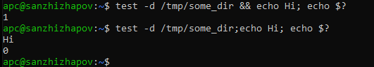
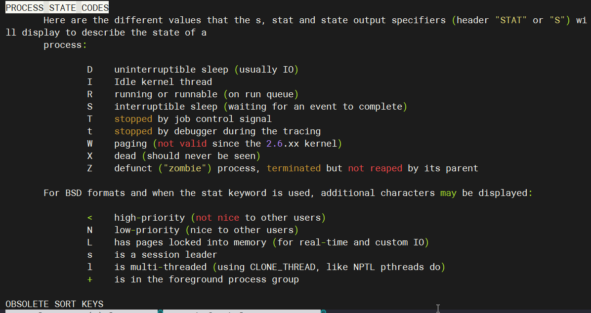
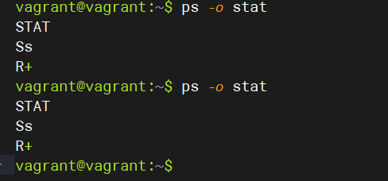

## Arsalan DEVOPS-24
### 3.3. Операционные системы, лекция 1

1. Какой системный вызов делает команда cd? В прошлом ДЗ мы выяснили, что cd не является самостоятельной программой, это shell builtin, поэтому запустить strace непосредственно на cd не получится. Тем не менее, вы можете запустить strace на /bin/bash -c 'cd /tmp'. В этом случае вы увидите полный список системных вызовов, которые делает сам bash при старте. Вам нужно найти тот единственный, который относится именно к cd.

<code>Выгрузил все системные вызовы в файл,утилитой grep нашел в выгруженном файле те системные вызовы которые обращались к директории '/tmp'. К директории обращались 3 системных вызова - execve,stat и chdir. execve - выполняет программу, stat - считывает состояние файла, chdir как раз относится именно к cd, изменяет рабочий каталог  </code>

2. Попробуйте использовать команду file на объекты разных типов на файловой системе. Используя strace выясните, где находится база данных file на основании которой она делает свои догадки.

<code>По моему анализу выходит два файла /etc/magic и /usr/share/misc/magic.mgc</code>

3. Предположим, приложение пишет лог в текстовый файл. Этот файл оказался удален (deleted в lsof), однако возможности сигналом сказать приложению переоткрыть файлы или просто перезапустить приложение – нет. Так как приложение продолжает писать в удаленный файл, место на диске постепенно заканчивается. 
Основываясь на знаниях о перенаправлении потоков предложите способ обнуления открытого удаленного файла (чтобы освободить место на файловой системе).

4. Занимают ли зомби-процессы какие-то ресурсы в ОС (CPU, RAM, IO)?

<code>Судя по результату не потребляет ресурсы, только создают процессы</code>

5. На какие файлы вы увидели вызовы группы open за первую секунду работы утилиты? Воспользуйтесь пакетом bpfcc-tools для Ubuntu 20.04.

 <code> В основном библиотеки, конфигурационные файлы, python скрипты </code>

6.Какой системный вызов использует uname -a? Приведите цитату из man по этому системному вызову, где описывается альтернативное местоположение в /proc, где можно узнать версию ядра и релиз ОС.

7. Чем отличается последовательность команд через ; и через && в bash? Есть ли смысл использовать в bash &&, если применить set -e?

<code> 
оператор ";" - выполняет команды последовательно в конвеере, не зависимо кода результат выполнения предыдущей команды.

оператор "&&" - выпоняет команды до первого не нулевого кода результата в конвеере, т.е следующая команда стоящая за оператором не будет выполнена
</code>

пример: в конце добавил вывод кода результата. 

Есть ли смысл использовать в bash &&, если применить set -e?

<code>думаю что да, будет полезна при написании скриптов как логический оператор</code>

8. Из каких опций состоит режим bash set -euxo pipefail и почему его хорошо было бы использовать в сценариях?

<code>
Параметр "-e" немедленно завершит работу, если любая команда выйдет с ошибкой,bash возвращает только код ошибки последней команды в пайпе (конвейере).
Если нужно убедиться, что все команды в пайпах завершились успешно, нужно использовать параметр "-o pipefail". Папаметр "-u" проверяет инициализацию переменных в скрипте. 
Если переменной не будет, скрипт немедленно завершиться. Параметр "-x" очень полезен при отладке. С помощью него bash печатает в стандартный вывод все команды перед их исполнением.
</code>

9. Используя -o stat для ps, определите, какой наиболее часто встречающийся статус у процессов в системе. В man ps ознакомьтесь (/PROCESS STATE CODES) что значат дополнительные к основной заглавной буквы статуса процессов. Его можно не учитывать при расчете (считать S, Ss или Ssl равнозначными).

<code> На моем ВМ это часто всречающий статус: Ss - запущен или доступен для выполнения (в очереди выполнения), маленькая "s" говорит что это лидер сеанса; 
R+ - запущен или доступен для выполнения (в очереди выполнения), "+" значит выполняется на переднем плане, то есть это не фоновый процесс</code>