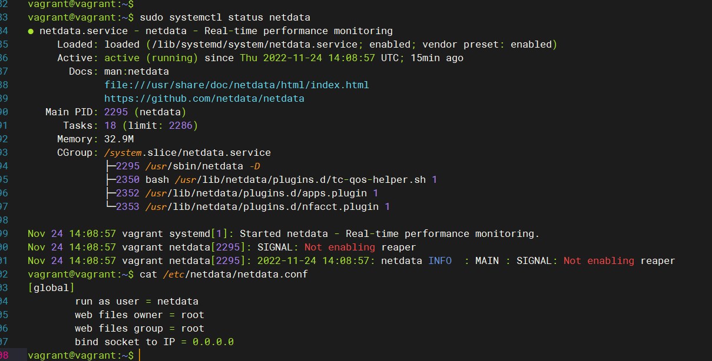
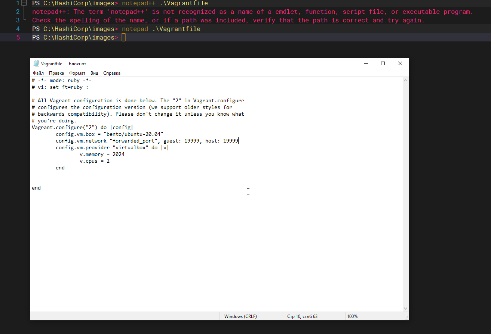
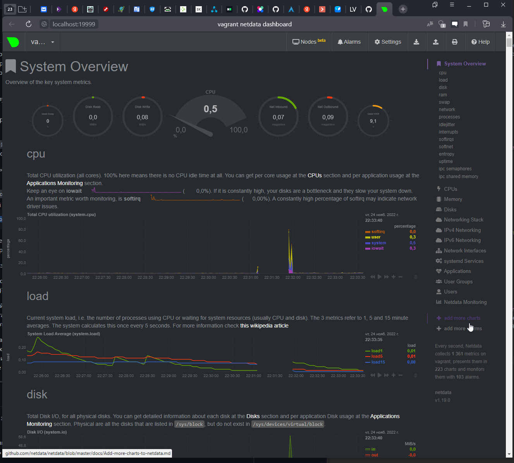
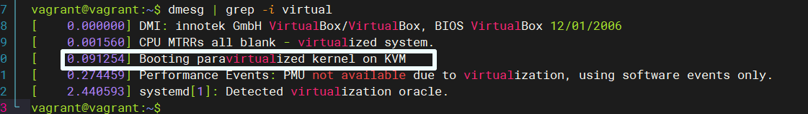

## Arsalan DEVOPS-24
### 3.4. Операционные системы, лекция 2

#### 1. На лекции мы познакомились с node_exporter. В демонстрации его исполняемый файл запускался в background. Этого достаточно для демо, но не для настоящей production-системы, где процессы должны находиться под внешним управлением.Используя знания из лекции по systemd, создайте самостоятельно простой unit-файл для node_exporter:

   * поместите его в автозагрузку,
   * предусмотрите возможность добавления опций к запускаемому процессу через внешний файл (посмотрите, например, на systemctl cat cron),
   * удостоверьтесь, что с помощью systemctl процесс корректно стартует, завершается, а после перезагрузки автоматически поднимается.

<details>
<summary>Ответ</summary>

<br>
<br>
<br>

</details>

#### 2. Ознакомьтесь с опциями node_exporter и выводом /metrics по-умолчанию. Приведите несколько опций, которые вы бы выбрали для базового мониторинга хоста по CPU, памяти, диску и сети.

<details>
<summary>Ответ</summary>


```
Для основных задач я выбрал бы эти:  
* collector.meminfo - Статистика памяти.
* collector.loadavg - Выводит среднюю нагрузку.
* collector.filesystem - Предоставляет статистику файловой системы, такую как используемое дисковое пространство.
* collector.diskstats - Выводит статистику ввода/вывода.
* collector.cpu - Выводит статистику процессора
* collector.cpufreq - Выводит статистику частоты процессора
* collector.os - Выводит различную информацию о ОС (Наименование хоста, версию )
* collector.netstat - выводит статистика сети
```
</details>

#### 3. Установите в свою виртуальную машину Netdata. Воспользуйтесь готовыми пакетами для установки (sudo apt install -y netdata). После успешной установки:
* в конфигурационном файле /etc/netdata/netdata.conf в секции [web] замените значение с localhost на bind to = 0.0.0.0
* добавьте в Vagrantfile проброс порта Netdata на свой локальный компьютер и сделайте vagrant reload:
`config.vm.network "forwarded_port", guest: 19999, host: 19999`
<details>
<summary>Ответ</summary>





</details>

#### 4. Можно ли по выводу dmesg понять, осознает ли ОС, что загружена не на настоящем оборудовании, а на системе виртуализации?

<details>
<summary>Ответ</summary>



</details>

#### 5. Как настроен sysctl fs.nr_open на системе по-умолчанию? Узнайте, что означает этот параметр. Какой другой существующий лимит не позволит достичь такого числа (ulimit --help)?

<details>
<summary>Ответ</summary>


</details>