## Arsalan DEVOPS-24

### 3.5. Файловые системы

#### 1. Узнайте о sparse (разряженных) файлах.

<details>
<summary>Ответ</summary>

 `Интересная технология, скорее сего эту тохнологию используют системы виртуализации при создании "тонких" дисков.`

</details>

#### 2. Могут ли файлы, являющиеся жесткой ссылкой на один объект, иметь разные права доступа и владельца? Почему?

<details>
<summary>Ответ</summary>


`Нет не могут, т.к. hardlink указывает на тод же файл и имеет один inode`

</details>

#### 3. Сделайте vagrant destroy на имеющийся инстанс Ubuntu. Замените содержимое Vagrantfile следующим:
```
 Vagrant.configure("2") do |config|
  config.vm.box = "bento/ubuntu-20.04"
  config.vm.provider :virtualbox do |vb|
    lvm_experiments_disk0_path = "/tmp/lvm_experiments_disk0.vmdk"
    lvm_experiments_disk1_path = "/tmp/lvm_experiments_disk1.vmdk"
    vb.customize ['createmedium', '--filename', lvm_experiments_disk0_path, '--size', 2560]
    vb.customize ['createmedium', '--filename', lvm_experiments_disk1_path, '--size', 2560]
    vb.customize ['storageattach', :id, '--storagectl', 'SATA Controller', '--port', 1, '--device', 0, '--type', 'hdd', '--medium', lvm_experiments_disk0_path]
    vb.customize ['storageattach', :id, '--storagectl', 'SATA Controller', '--port', 2, '--device', 0, '--type', 'hdd', '--medium', lvm_experiments_disk1_path]
  end
 end
```

<details>
<summary>Ответ</summary>

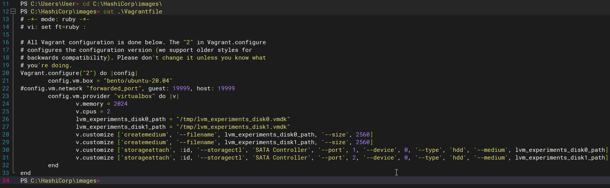
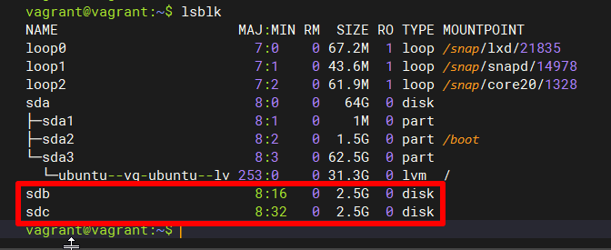

</details>

#### 4. Используя fdisk, разбейте первый диск на 2 раздела: 2 Гб, оставшееся пространство.

<details>
<summary>Ответ</summary>

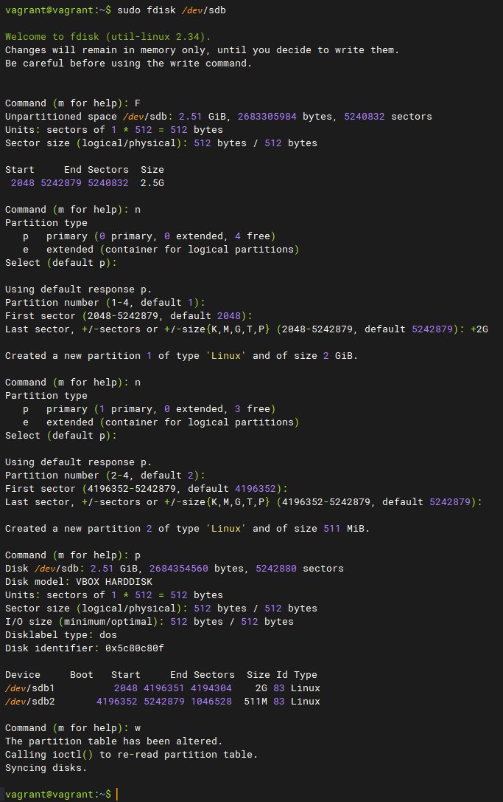

</details>

#### 5. Используя sfdisk, перенесите данную таблицу разделов на второй диск.

<details>
<summary>Ответ</summary>

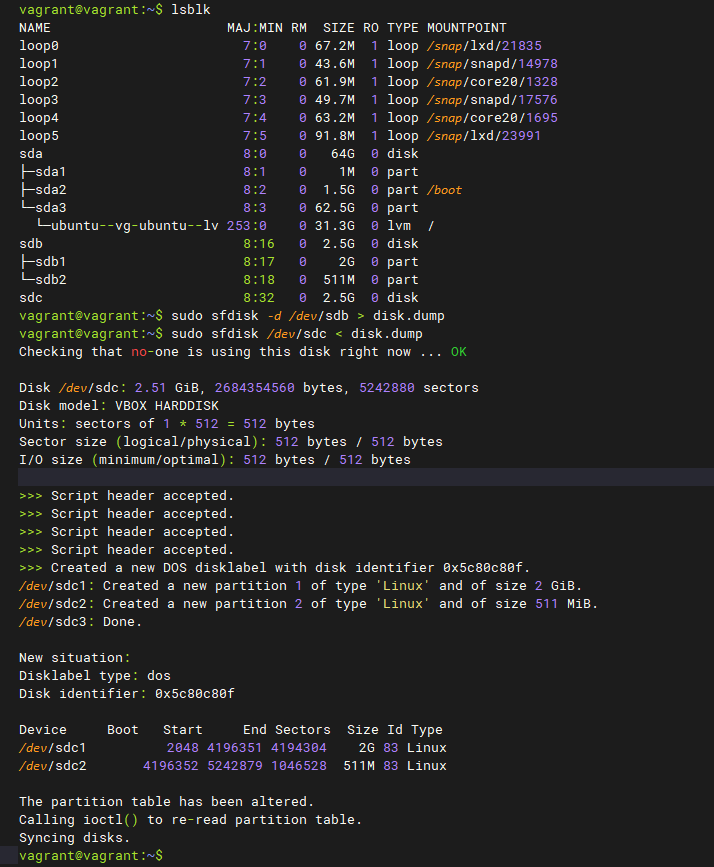

</details>

#### 6. Соберите mdadm RAID1 на паре разделов 2 Гб.

<details>
<summary>Ответ</summary>

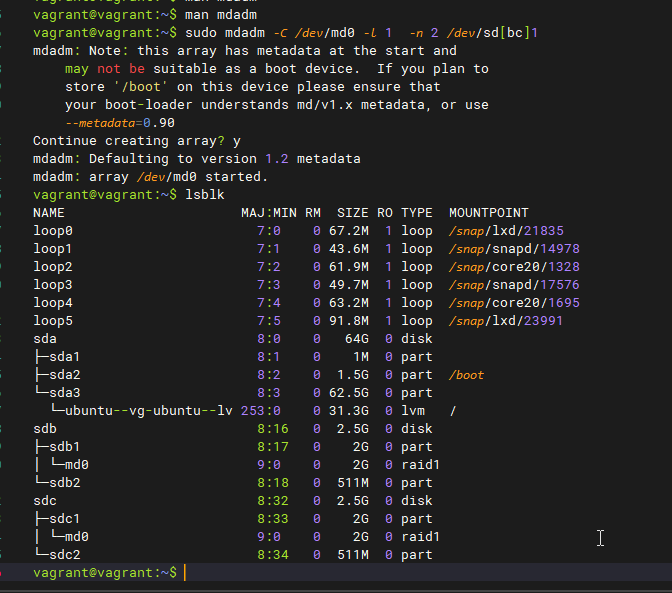

</details>

#### 7. Соберите mdadm RAID0 на второй паре маленьких разделов.

<details>
<summary>Ответ</summary>

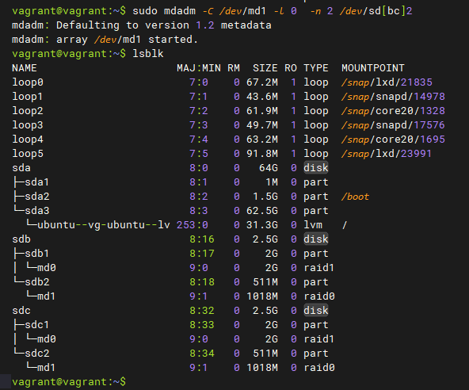

</details>

#### 8. Создайте 2 независимых PV на получившихся md-устройствах.

<details>
<summary>Ответ</summary>

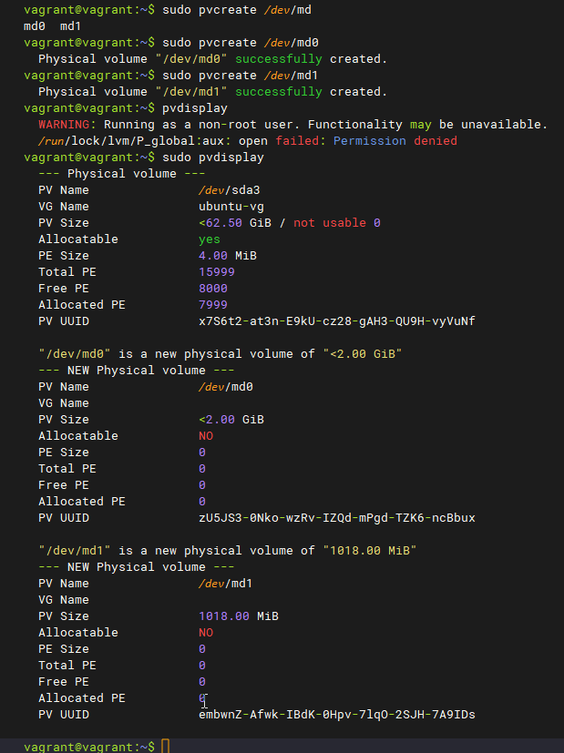

</details>

#### 9. Создайте общую volume-group на этих двух PV.

<details>
<summary>Ответ</summary>

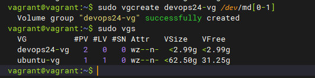

</details>

#### 10. Создайте LV размером 100 Мб, указав его расположение на PV с RAID0.

<details>
<summary>Ответ</summary>

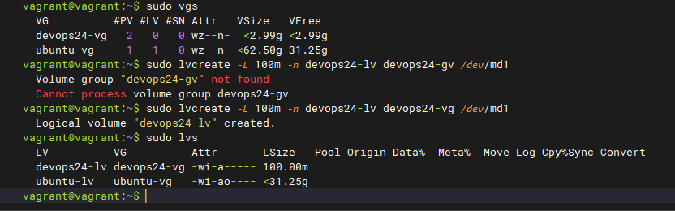

</details>

#### 11. Создайте mkfs.ext4 ФС на получившемся LV.

<details>
<summary>Ответ</summary>

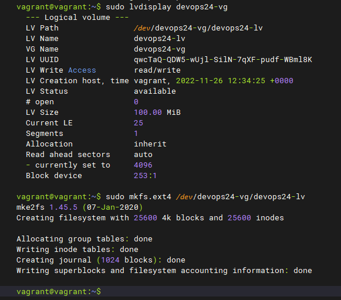

</details>

#### 12. Смонтируйте этот раздел в любую директорию, например, /tmp/new.

<details>
<summary>Ответ</summary>

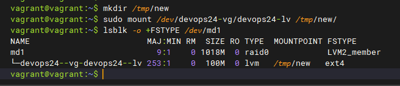

</details>

#### 13. Поместите туда тестовый файл, например wget https://mirror.yandex.ru/ubuntu/ls-lR.gz -O /tmp/new/test.gz.

<details>
<summary>Ответ</summary>

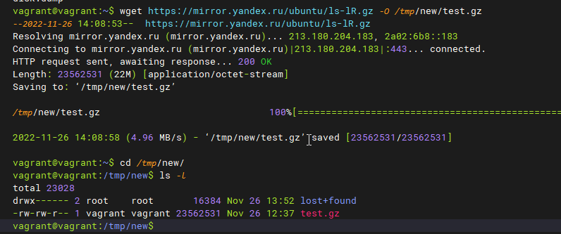

</details>

#### 14. Прикрепите вывод lsblk.

<details>
<summary>Ответ</summary>

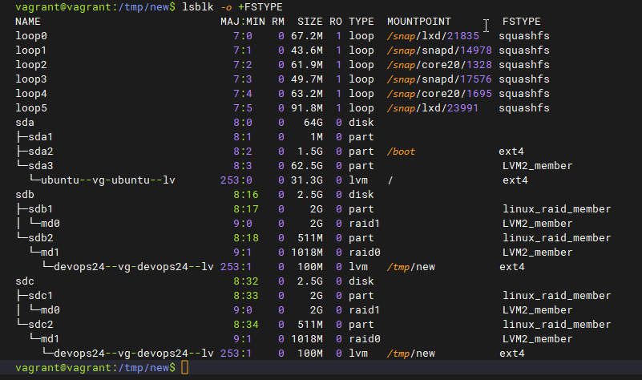

</details>

#### 15. Протестируйте целостность файла.

<details>
<summary>Ответ</summary>

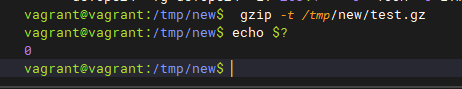

</details>

#### 16. Используя pvmove, переместите содержимое PV с RAID0 на RAID1.

<details>
<summary>Ответ</summary>

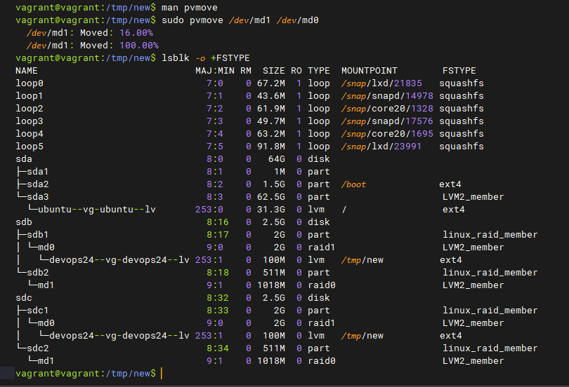

</details>

#### 17. Сделайте --fail на устройство в вашем RAID1 md.

<details>
<summary>Ответ</summary>

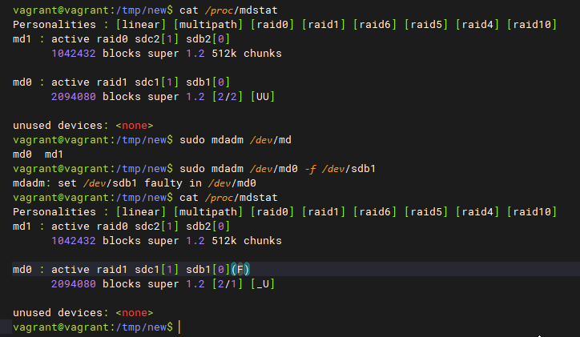

</details>

#### 18. Подтвердите выводом dmesg, что RAID1 работает в деградированном состоянии.

<details>
<summary>Ответ</summary>

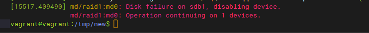

</details>

#### 19. Протестируйте целостность файла, несмотря на "сбойный" диск он должен продолжать быть доступен.

<details>
<summary>Ответ</summary>

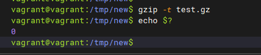

</details>

#### 20. Погасите тестовый хост, vagrant destroy.

<details>
<summary>Ответ</summary>

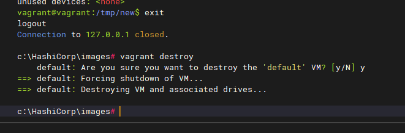

</details>