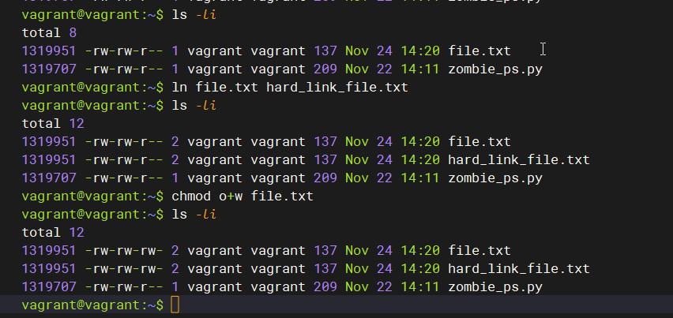

## Arsalan DEVOPS-24

### 3.5. Файловые системы

#### 1. Узнайте о sparse (разряженных) файлах.

<details>
<summary>Ответ</summary>

</details>

#### 2. Могут ли файлы, являющиеся жесткой ссылкой на один объект, иметь разные права доступа и владельца? Почему?

<details>
<summary>Ответ</summary>



`Нет не могут, т.к. hardlink указывает на тод же файл и имеет один inode`

</details>

#### 3. Сделайте vagrant destroy на имеющийся инстанс Ubuntu. Замените содержимое Vagrantfile следующим:
```
 Vagrant.configure("2") do |config|
  config.vm.box = "bento/ubuntu-20.04"
  config.vm.provider :virtualbox do |vb|
    lvm_experiments_disk0_path = "/tmp/lvm_experiments_disk0.vmdk"
    lvm_experiments_disk1_path = "/tmp/lvm_experiments_disk1.vmdk"
    vb.customize ['createmedium', '--filename', lvm_experiments_disk0_path, '--size', 2560]
    vb.customize ['createmedium', '--filename', lvm_experiments_disk1_path, '--size', 2560]
    vb.customize ['storageattach', :id, '--storagectl', 'SATA Controller', '--port', 1, '--device', 0, '--type', 'hdd', '--medium', lvm_experiments_disk0_path]
    vb.customize ['storageattach', :id, '--storagectl', 'SATA Controller', '--port', 2, '--device', 0, '--type', 'hdd', '--medium', lvm_experiments_disk1_path]
  end
 end
```

<details>
<summary>Ответ</summary>

</details>
