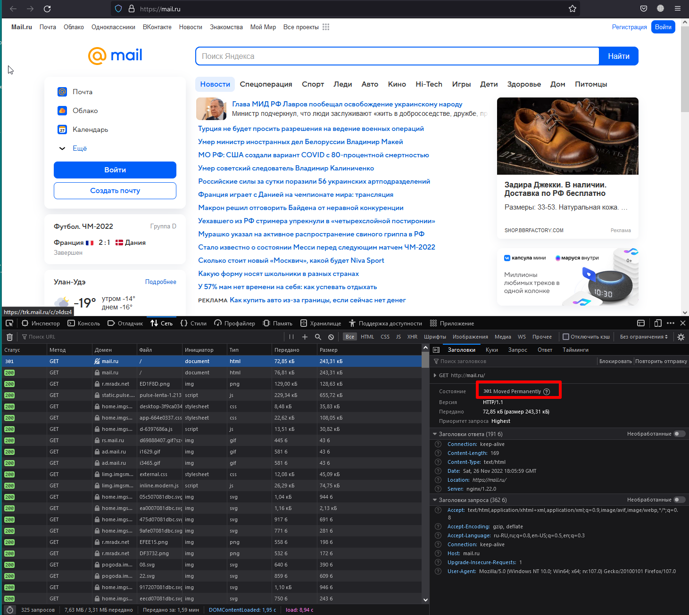
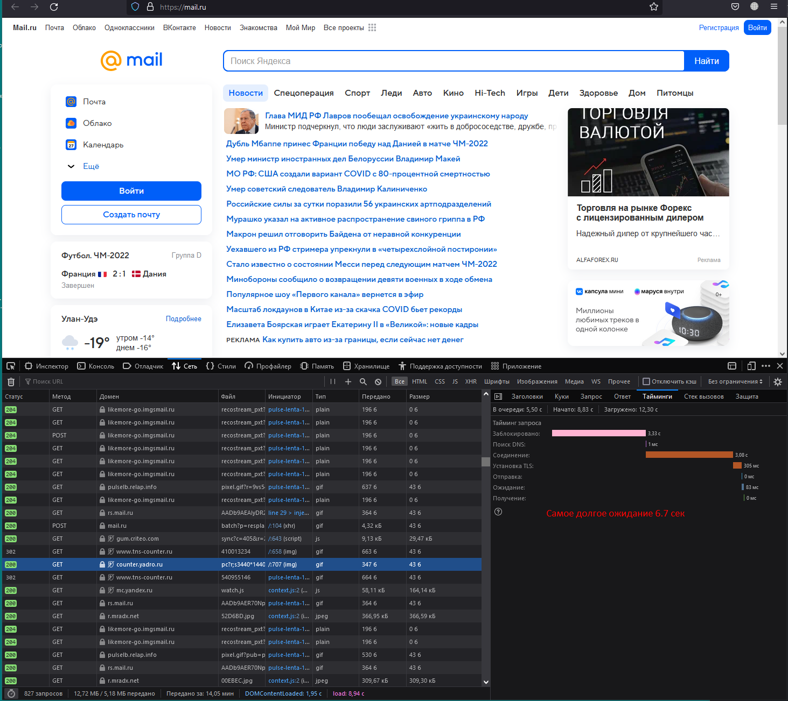
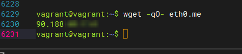
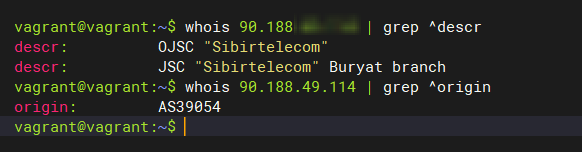
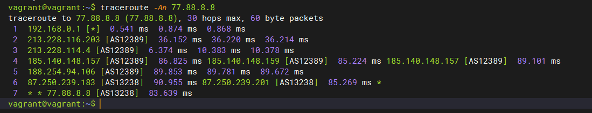
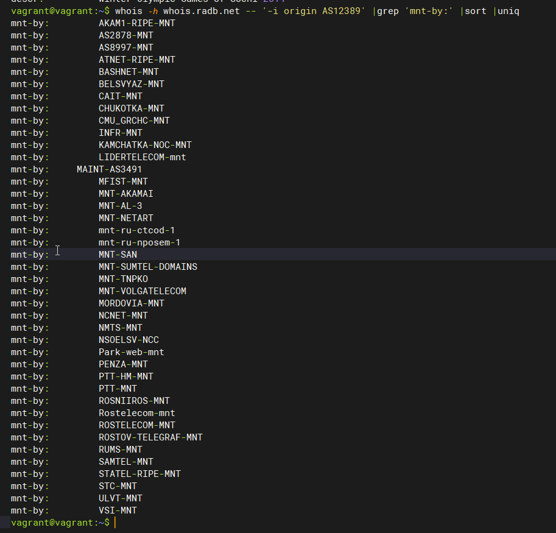
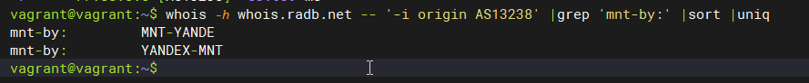
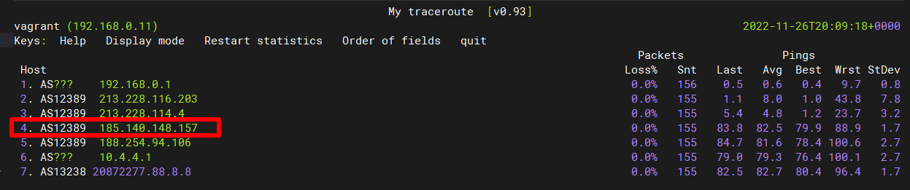
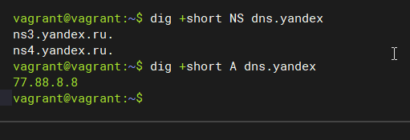
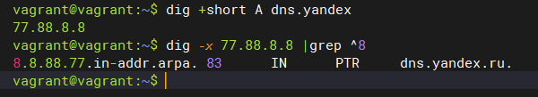

## Arsalan DEVOPS-24

### 3.6. Компьютерные сети. Лекция 1

#### 1. Работа c HTTP через телнет.
 
* Подключитесь утилитой телнет к сайту
* Отправьте HTTP запрос

Ответ

`Код 301 означает перенаправление на другой url-адрес`

#### 2. Повторите задание 1 в браузере, используя консоль разработчика F12.

* откройте вкладку Network
* отправьте запрос на сайт
* найдите первый ответ HTTP сервера, откройте вкладку Headers
* укажите в ответе полученный HTTP код
* проверьте время загрузки страницы, какой запрос обрабатывался дольше всего?
* приложите скриншот консоли браузера в ответ.

Ответ

#### 3. Какой IP адрес у вас в интернете?

Ответ

#### 4. Какому провайдеру принадлежит ваш IP адрес? Какой автономной системе AS? Воспользуйтесь утилитой whois.

Ответ

#### 5. Через какие сети проходит пакет, отправленный с вашего компьютера на адрес 77.88.8.8? Через какие AS? Воспользуйтесь утилитой traceroute.

Ответ

#### 6. Повторите задание 5 в утилите mtr. На каком участке наибольшая задержка - delay?

Ответ

#### 7. Какие DNS сервера отвечают за доменное имя dns.yandex? Какие A записи? Воспользуйтесь утилитой dig.

Ответ

#### 8. Проверьте PTR записи для IP адресов из задания 7. Какое доменное имя привязано к IP? Воспользуйтесь утилитой dig.

Ответ

