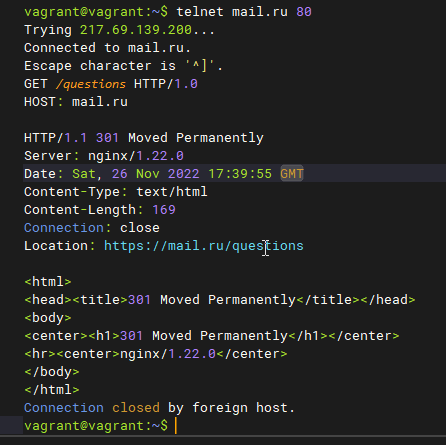

## Arsalan DEVOPS-24

#### 1. Работа c HTTP через телнет.

``` 
* Подключитесь утилитой телнет к сайту
* Отправьте HTTP запрос
```

<details>
<summary>Ответ</summary>



`Код 301 означает перенаправление на другой url-адрес`
</details>

#### 2. Повторите задание 1 в браузере, используя консоль разработчика F12.

<details>
<summary>Ответ</summary>

</details>