## Arsalan DEVOPS-24

### 3.8. Компьютерные сети. Лекция 3

#### 1. Подключитесь к публичному маршрутизатору в интернет. Найдите маршрут к вашему публичному IP

<details>
<summary>Ответ</summary>


</details>

#### 2. Создайте dummy0 интерфейс в Ubuntu. Добавьте несколько статических маршрутов. Проверьте таблицу маршрутизации.

<details>
<summary>Ответ</summary>

``` 
Поднял интерфейс dummy1 с ip 10.10.10.1/24, прописал статический маршрут хоста ya.ru на этот интерфейс и 
снял дамп трафика для проверки маршрутизации.   
```
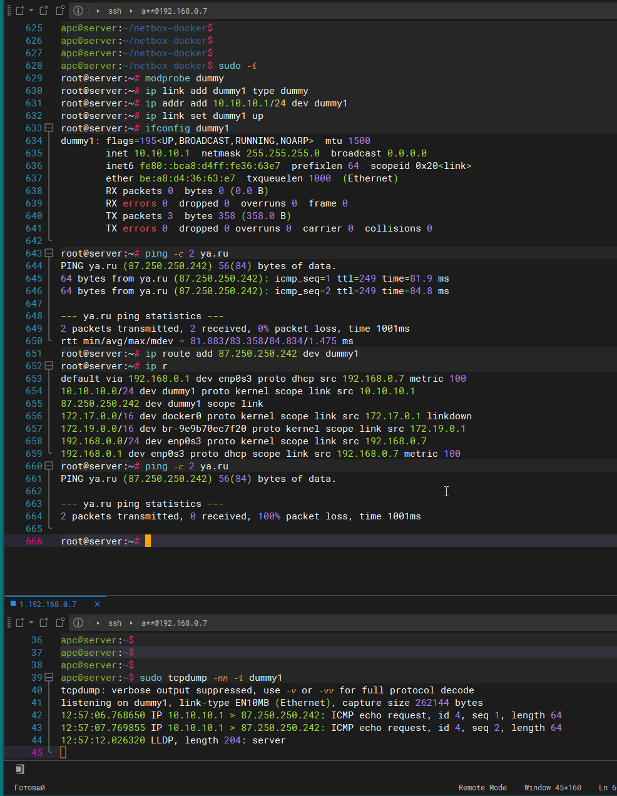

</details>

#### 3. Проверьте открытые TCP порты в Ubuntu, какие протоколы и приложения используют эти порты? Приведите несколько примеров.

<details>
<summary>Ответ</summary>

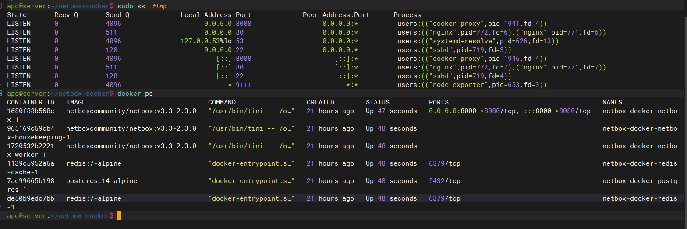

```
8000 порт прокси нетбокса развернут в docker
80 порт прокси nginx
53 порту работают днс запросы
22 порт удаленного управления сервером
9111 порт для приложение node_exporter, осущестляет сбор метрик с сервера 
```
</details>

#### 4. Проверьте используемые UDP сокеты в Ubuntu, какие протоколы и приложения используют эти порты?

<details>
<summary>Ответ</summary>

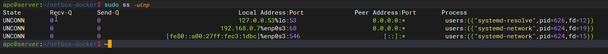

``` 
53 порту работают днс запросы
68 порт для dhcp клиента
546 порт для dhcp клиента ipv6
```
</details>

#### 5. Используя diagrams.net, создайте L3 диаграмму вашей домашней сети или любой другой сети, с которой вы работали.

<details>
<summary>Ответ</summary>

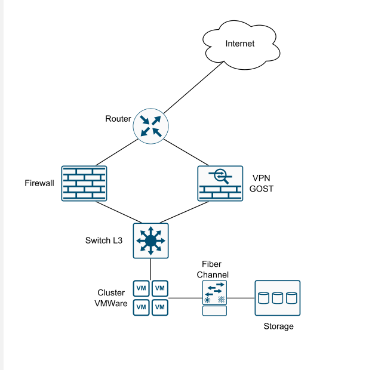
</details>

#### 6. Установите Nginx, настройте в режиме балансировщика TCP или UDP.

<details>
<summary>Ответ</summary>

`В конфиг nginx добавил не существующие сервера и снял дамп трафика, балансировка работает по стратегии "Round Robin" т.е. поочередно`

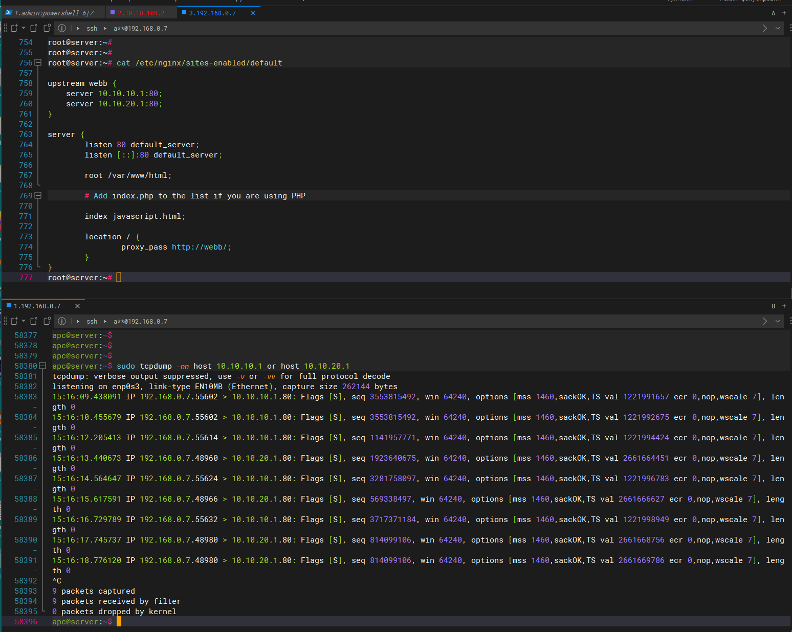

</details>

#### 7. Установите bird2, настройте динамический протокол маршрутизации RIP. 

<details>
<summary>Ответ</summary>

Схема сети тестового стенда.

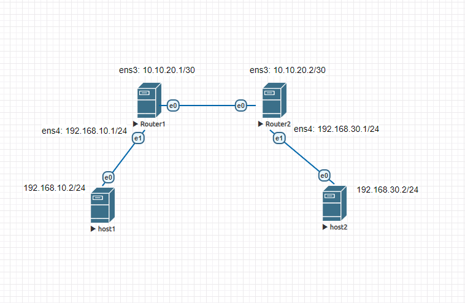

Настройки маршрутизаторов: 

`Router1`

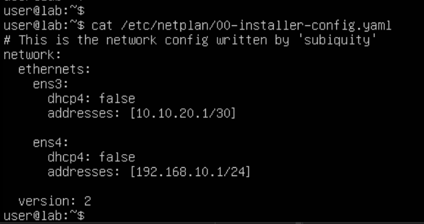

`Router2`

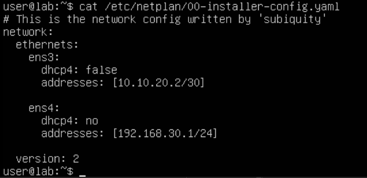

Настройки bird2 для Router1 и Router2 идентичны:

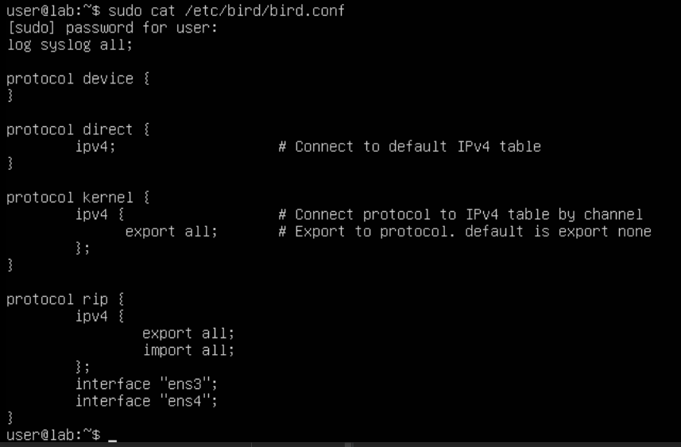

Маршруты после включения динамической маршрутизации:

`Router1`

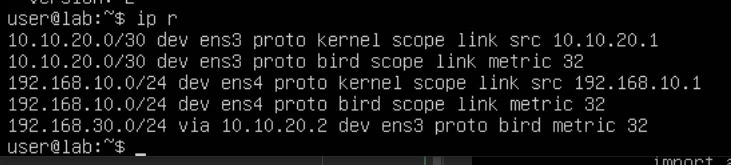

`Router2`

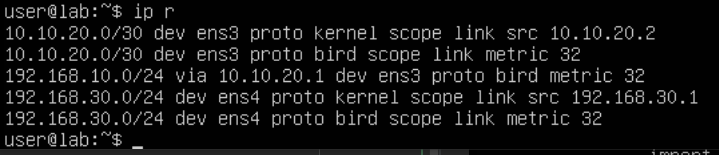

Из скринов видно что маршруты получены. Проведем тестирование host1(192.168.10.2) и host2(192.168.30.2) должны "видеть" друг друга.

`Host1`

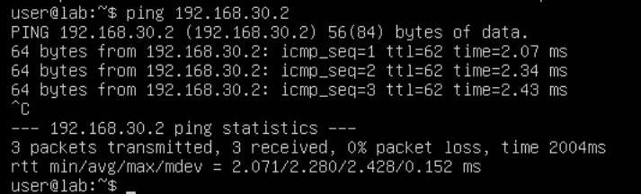

`Host2`

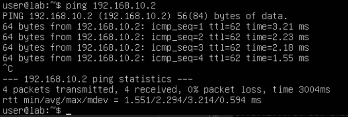

</details>

#### 8. Установите Netbox, создайте несколько IP префиксов, используя curl проверьте работу API.

<details>
<summary>Ответ</summary>

Развернул netbox в docker`е 

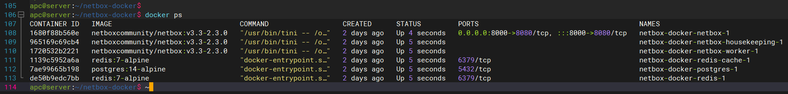
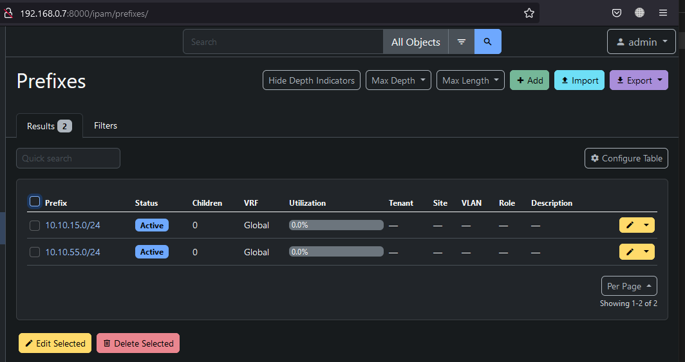
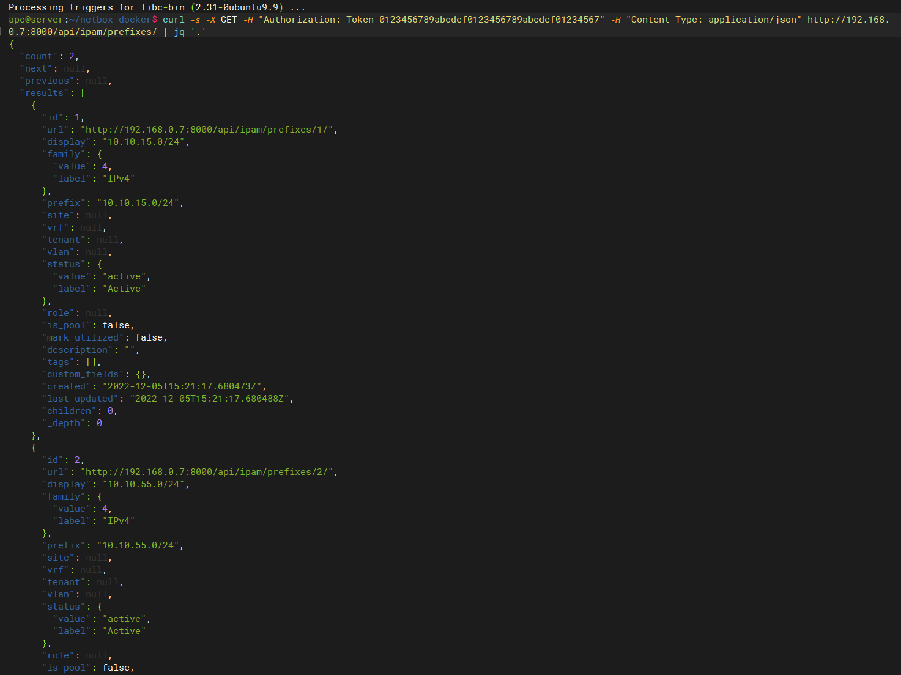

</details>