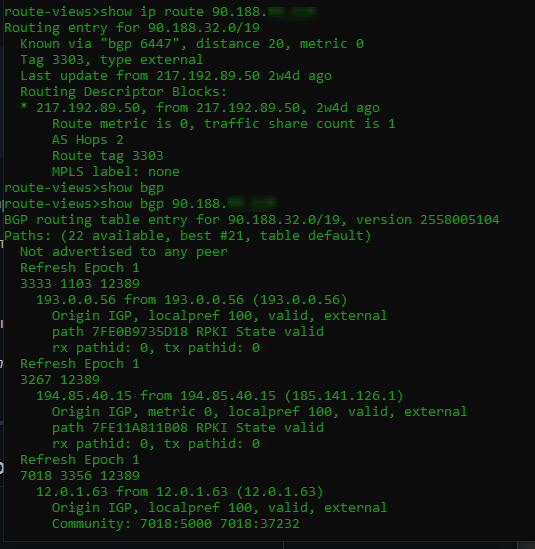

## Arsalan DEVOPS-24

### 3.8. Компьютерные сети. Лекция 3

#### 1. Подключитесь к публичному маршрутизатору в интернет. Найдите маршрут к вашему публичному IP

Ответ

#### 2. Создайте dummy0 интерфейс в Ubuntu. Добавьте несколько статических маршрутов. Проверьте таблицу маршрутизации.

Ответ

