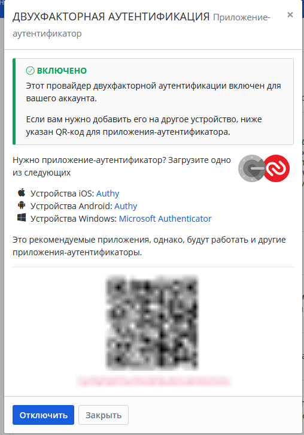
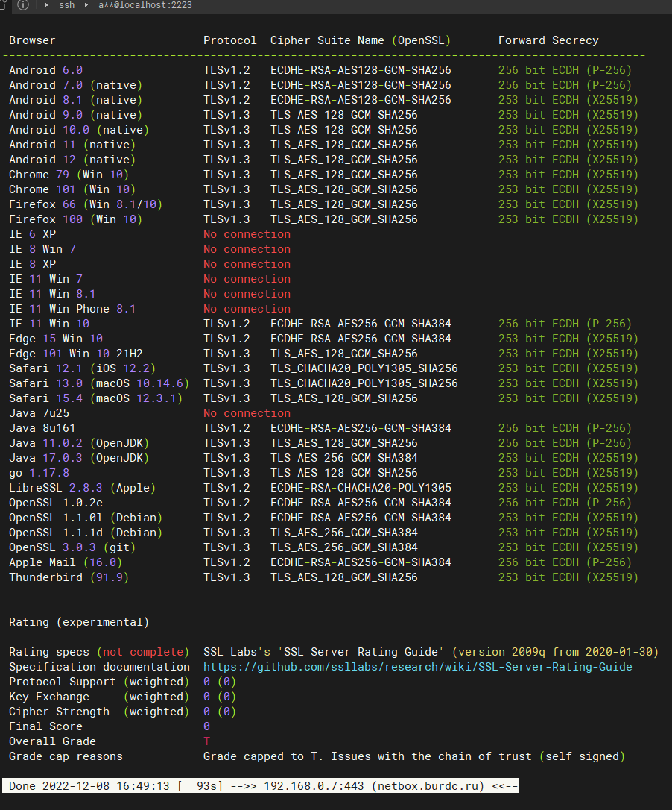

## Arsalan DEVOPS-24

### 3.9. Элементы безопасности информационных систем.

#### 1. Установите Bitwarden плагин для браузера. Зарегистрируйтесь и сохраните несколько паролей.

Ответ

#### 2. Установите Google authenticator на мобильный телефон. Настройте вход в Bitwarden аккаунт через Google authenticator OTP.

Ответ

#### 3. Установите apache2, сгенерируйте самоподписанный сертификат, настройте тестовый сайт для работы по HTTPS.

Ответ

`В место apache2 использовал nginx.`

#### 4. Проверьте на TLS уязвимости произвольный сайт в интернете.

Ответ

`Проверял веб сервер сделаный с самоподписным сертификатом в задании №3.`

#### 5. Установите на Ubuntu ssh сервер, сгенерируйте новый приватный ключ. Скопируйте свой публичный ключ на другой сервер. Подключитесь к серверу по SSH-ключу.

Ответ

#### 6. Переименуйте файлы ключей из задания 5. Настройте файл конфигурации SSH клиента, так чтобы вход на удаленный сервер осуществлялся по имени сервера.

Ответ

#### 7. Соберите дамп трафика утилитой tcpdump в формате pcap, 100 пакетов. Откройте файл pcap в Wireshark.

Ответ

#### 8. Просканируйте хост scanme.nmap.org. Какие сервисы запущены?

Ответ

`Запущены openssh, веб сервер на паче, nping - инструмент генерации сетевых пакетов, 
tcpwrapped означает, что полное рукопожатие TCP было завершено, но удаленный хост закрыл соединение, не получив никаких данных`

#### 9. Установите и настройте фаервол ufw на web-сервер из задания 3. Откройте доступ снаружи только к портам 22,80,443

Ответ

