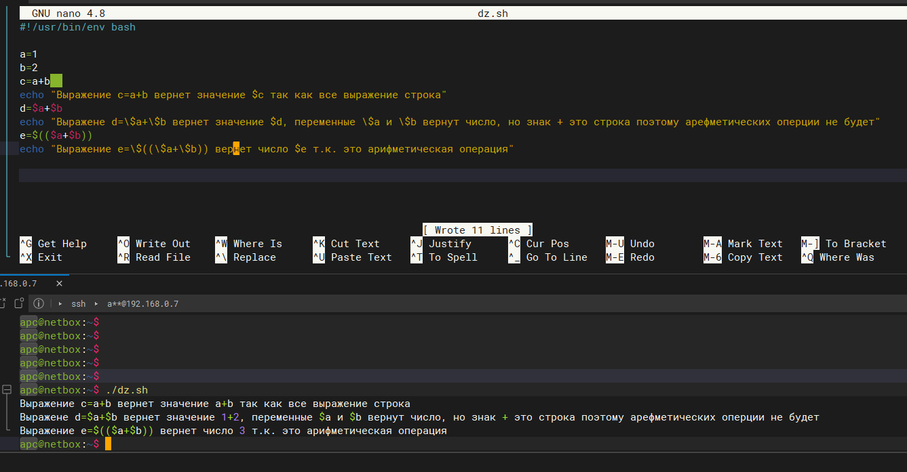

## Arsalan DEVOPS-24

### 4.1. Командная оболочка Bash: Практические навыки. 

#### 1. Есть скрипт:
``` 
a=1
b=2
c=a+b
d=$a+$b
e=$(($a+$b))
```
* Какие значения переменным c,d,e будут присвоены?
* Почему?

<details>
<summary>Ответ</summary>


</details>

#### 2. На нашем локальном сервере упал сервис и мы написали скрипт, который постоянно проверяет его доступность, записывая дату проверок до тех пор, пока сервис не станет доступным. В скрипте допущена ошибка, из-за которой выполнение не может завершиться, при этом место на Жёстком Диске постоянно уменьшается. Что необходимо сделать, чтобы его исправить:
```
while ((1==1)
do
curl https://localhost:4757
if (($? != 0))
then
date >> curl.log
fi
done
```