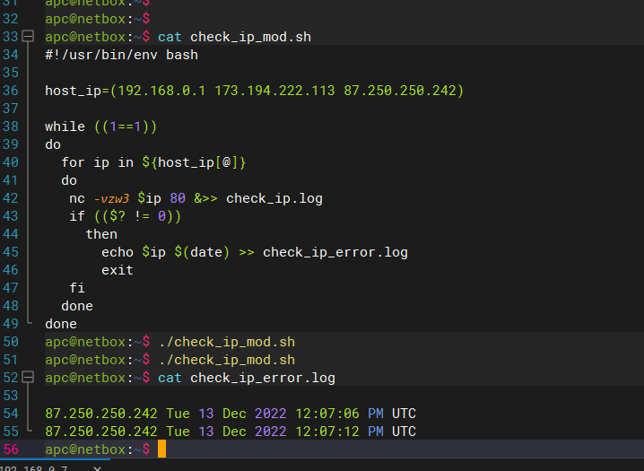

## Arsalan DEVOPS-24

### 4.1. Командная оболочка Bash: Практические навыки. 

#### 1. Есть скрипт:
``` 
a=1
b=2
c=a+b
d=$a+$b
e=$(($a+$b))
```
* Какие значения переменным c,d,e будут присвоены?
* Почему?

<details>
<summary>Ответ</summary>


</details>

#### 2. На нашем локальном сервере упал сервис и мы написали скрипт, который постоянно проверяет его доступность, записывая дату проверок до тех пор, пока сервис не станет доступным. В скрипте допущена ошибка, из-за которой выполнение не может завершиться, при этом место на Жёстком Диске постоянно уменьшается. Что необходимо сделать, чтобы его исправить:
```
while ((1==1))
do
curl https://localhost:4757
if (($? != 0))
then
date >> curl.log
fi
done
```

<details>
<summary>Ответ</summary>

```commandline
#!/usr/bin/env bash

while ((1==1))
do
 curl -I http://localhost:4757
 if (($? != 0));
   then
     date >> curl.log
   else
     exit
 fi
done
```
</details>

#### 3. Необходимо написать скрипт, который проверяет доступность трёх IP: 192.168.0.1, 173.194.222.113, 87.250.250.242 по 80 порту и записывает результат в файл log. Проверять доступность необходимо пять раз для каждого узла.

<details>
<summary>Ответ</summary>


</details>

#### 4. Необходимо дописать скрипт из предыдущего задания так, чтобы он выполнялся до тех пор, пока один из узлов не окажется недоступным. Если любой из узлов недоступен - IP этого узла пишется в файл error, скрипт прерывается.
<details>
<summary>Ответ</summary>

`Для тестирования скрипта с имитировал не достопность одного хоста,закрыл на файрволе исходящие до 87.250.250.242`




</details>

