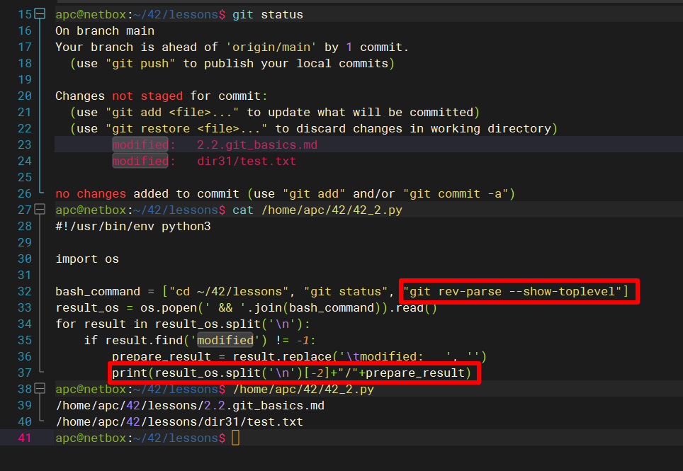

## Arsalan DEVOPS-24

### 4.2. Использование Python для решения типовых DevOps задач

#### 1. Есть скрипт:
```python
#!/usr/bin/env python3
a = 1
b = '2'
c = a + b
```
* Какое значение будет присвоено переменной c?
* Как получить для переменной c значение 12?
* Как получить для переменной c значение 3?

<details>
<summary>Ответ</summary>


</details>

#### 2. Мы устроились на работу в компанию, где раньше уже был DevOps Engineer. Он написал скрипт, позволяющий узнать, какие файлы модифицированы в репозитории, относительно локальных изменений. Этим скриптом недовольно начальство, потому что в его выводе есть не все изменённые файлы, а также непонятен полный путь к директории, где они находятся. Как можно доработать скрипт ниже, чтобы он исполнял требования вашего руководителя?

```python
#!/usr/bin/env python3

import os

bash_command = ["cd ~/netology/sysadm-homeworks", "git status"]
result_os = os.popen(' && '.join(bash_command)).read()
is_change = False
for result in result_os.split('\n'):
    if result.find('modified') != -1:
        prepare_result = result.replace('\tmodified:   ', '')
        print(prepare_result)
        break
```

<details>
<summary>Ответ</summary>


</details>

#### 3. Доработать скрипт выше так, чтобы он мог проверять не только локальный репозиторий в текущей директории, а также умел воспринимать путь к репозиторию, который мы передаём как входной параметр. Мы точно знаем, что начальство коварное и будет проверять работу этого скрипта в директориях, которые не являются локальными репозиториями.

<details>
<summary>Ответ</summary>

`Переписал скрипт, возможно усложнил код, но работает`


</details>
