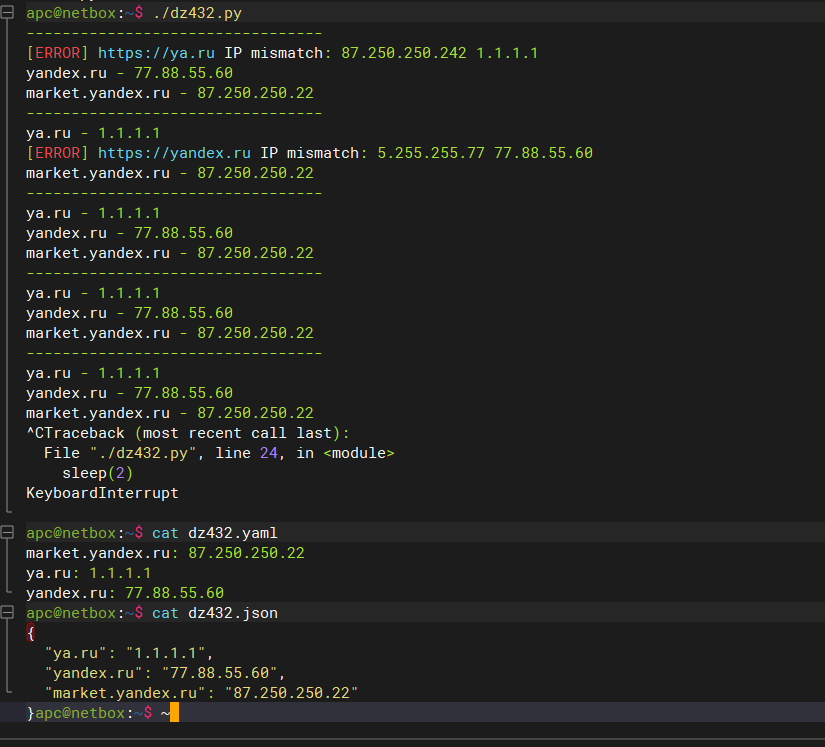

## Arsalan DEVOPS-24

### 4.3. Языки разметки JSON и YAML.

#### 1. Мы выгрузили JSON, который получили через API запрос к нашему сервису: 
```json
{ "info" : "Sample JSON output from our service\t",
    "elements" :[
        { "name" : "first",
        "type" : "server",
        "ip" : 7175 
        },
        { "name" : "second",
        "type" : "proxy",
        "ip : 71.78.22.43
        }
    ]
}
```
Нужно найти и исправить все ошибки, которые допускает наш сервис

<details>
<summary>Ответ</summary>


</details>


#### 2.В прошлый рабочий день мы создавали скрипт, позволяющий опрашивать веб-сервисы и получать их IP. К уже реализованному функционалу нам нужно добавить возможность записи JSON и YAML файлов, описывающих наши сервисы. Формат записи JSON по одному сервису: { "имя сервиса" : "его IP"}. Формат записи YAML по одному сервису: - имя сервиса: его IP. Если в момент исполнения скрипта меняется IP у сервиса - он должен так же поменяться в yml и json файле.
Прошлый мой скрипт:
```python
#!/usr/bin/env python3

from socket import gethostbyname
from time import sleep


servers = {'ya.ru':'87.250.250.242','yandex.ru':'5.255.255.77','market.yandex.ru':'87.250.250.22'}

while True:
        print("---------------------------------")
        for key in servers:
                if gethostbyname(key) != servers[key]:
                        print(f"[ERROR] https://{key} IP mismatch: {servers[key]} {gethostbyname(key)}")
                        servers[key] = gethostbyname(key)
                else:
                        print(f"{key} - {gethostbyname(key)}")
        sleep(2)
```
<details>
<summary>Ответ</summary>



</details>


#### 3. 

<details>
<summary>Ответ</summary>


</details>