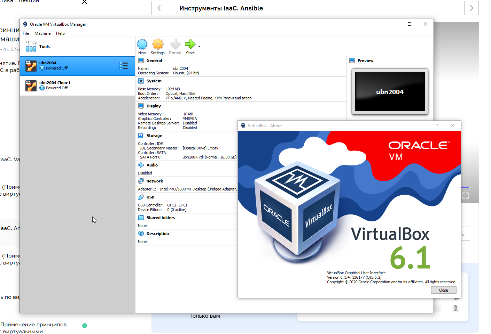
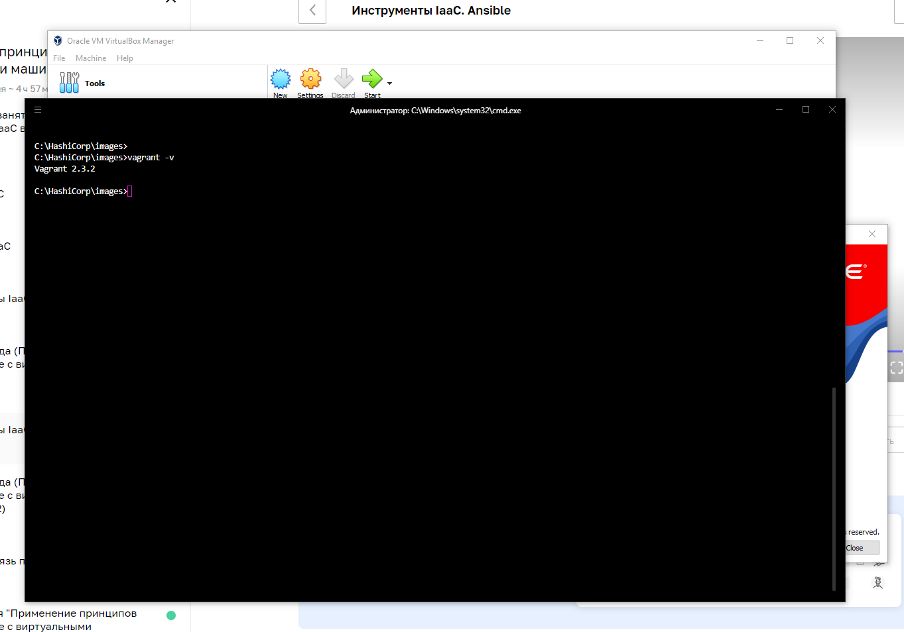
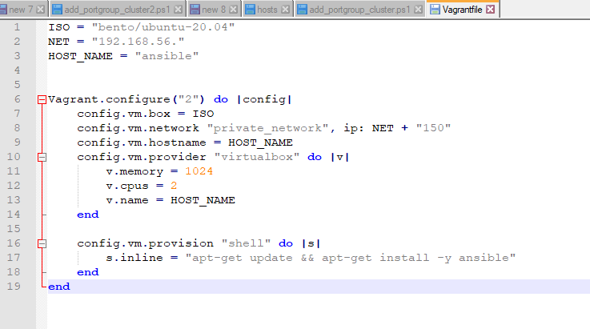
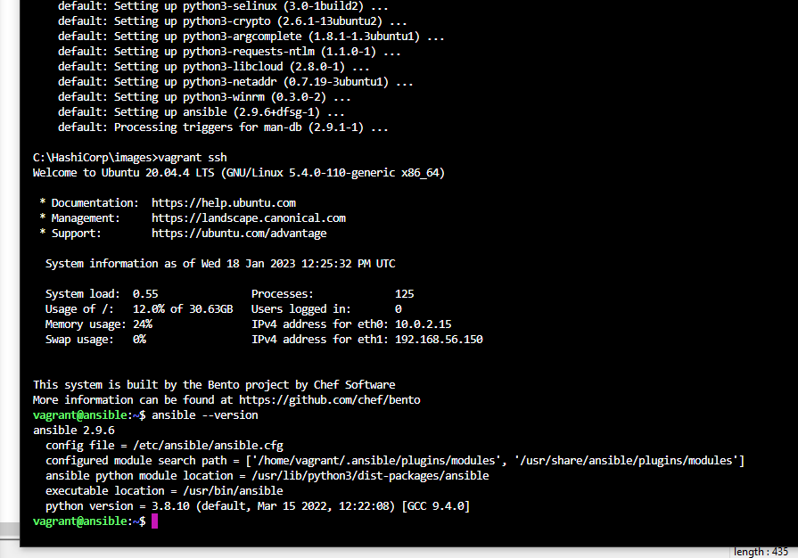
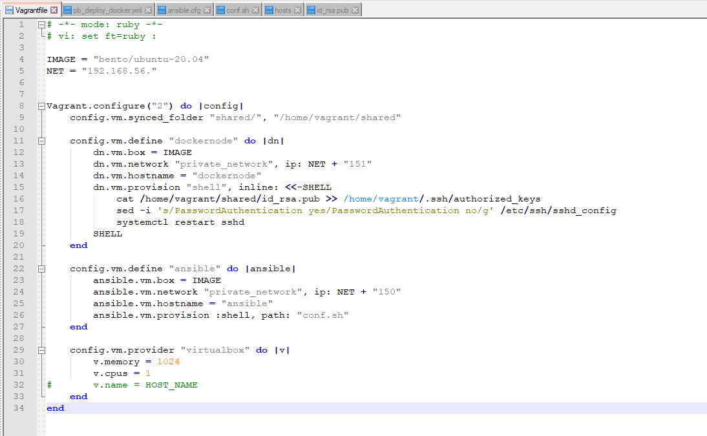
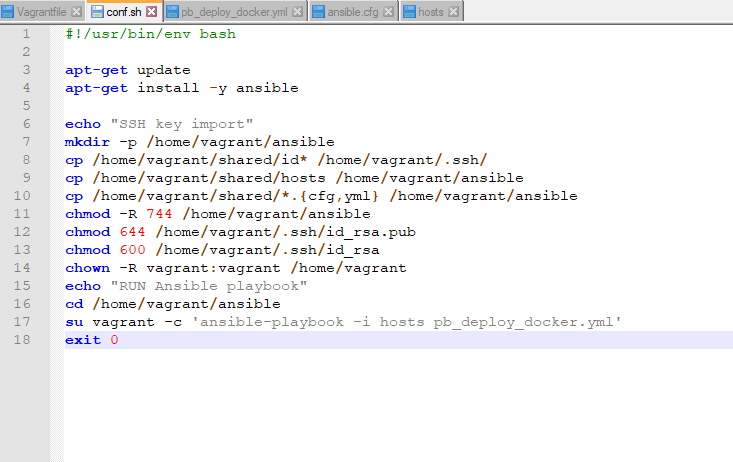
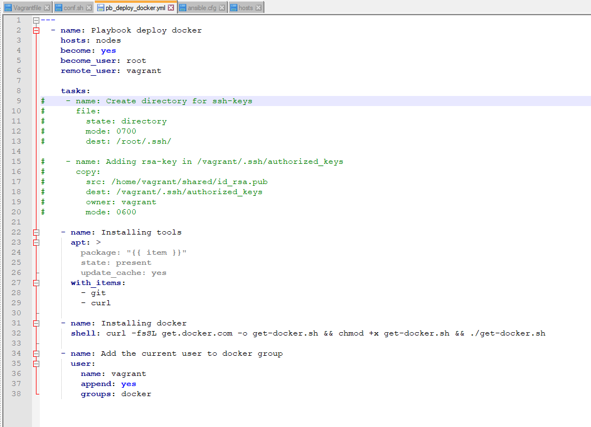
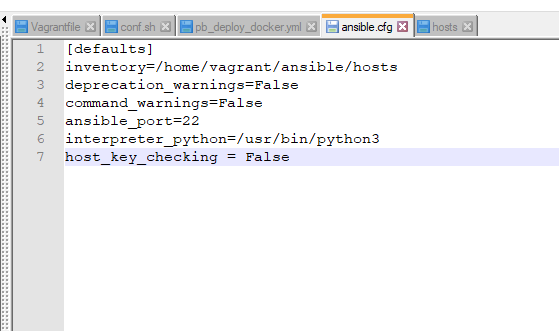
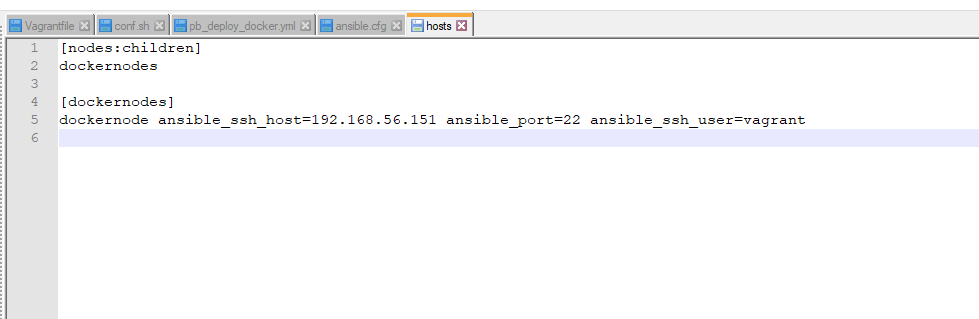
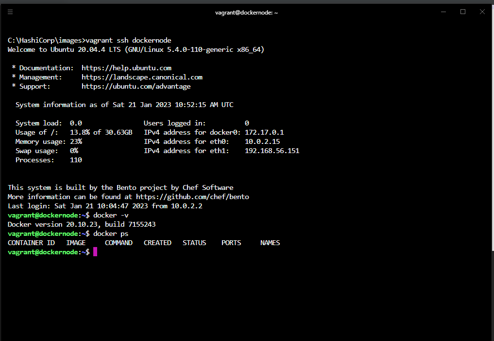

## Arsalan DEVOPS-24

### 5.2. Применение принципов IaaC в работе с виртуальными машинами

####  Задача 1

> Опишите своими словами основные преимущества применения на практике IaaC паттернов.

Ответ

* Ускорение производства и вывода продукта на рынок
* Стабильность среды, устранение дрейфа конфигураций
* Более быстрая и эффективная разработка

> Какой из принципов IaaC является основополагающим?

Ответ

Идемпотентность — это свойство объекта или операции, при повторном выполнении 
которой мы получаем результат идентичный предыдущему и всем последующим выполнениям

#### Задача 2

> Чем Ansible выгодно отличается от других систем управление конфигурациями?

Ответ

1. Легкое развертывание и низкий порог входа
2. Не нужно использовать агента
3. Связь осуществляется с помощью SSH

> Какой, на ваш взгляд, метод работы систем конфигурации более надёжный push или pull?

Ответ

Push надежнее, в pull режиме сложнее спрогнозировать применение конфигурации.

#### Задача 3

Установить на личный компьютер:
> VirtualBox

Ответ

> Vagrant

Ответ

> Ansible

Ответ

### Задача 4 (*)

Воспроизвести практическую часть лекции самостоятельно.

* Создать виртуальную машину.
* Зайти внутрь ВМ, убедиться, что Docker установлен с помощью команды

Ответ

Так как у меня домашний пк на ОС Windows, поэтому создал два отдельный ВМ для ansible и docker. 
Примонтировал общий диск для этих ВМ, где лежат ssh ключи и скрипты для конфигурирования ВМ.   

Кофигурация Vagrant файла, тут стразу импортирую ssh ключи в ВМ docker и отключаю авторизацию по паролю. 

Cкрипт для конфигурирования ВМ Ansible:
здесь устанавливаю сам ansible, переношу в домашнюю папку файлы конфигурации ansible и ssh ключи пользователю vagrant, назначаю необходимые права и запускаю плейбук от пользователя vagrant.  

Конфигурационные файлы и плейбук ansible: 

Результат:

