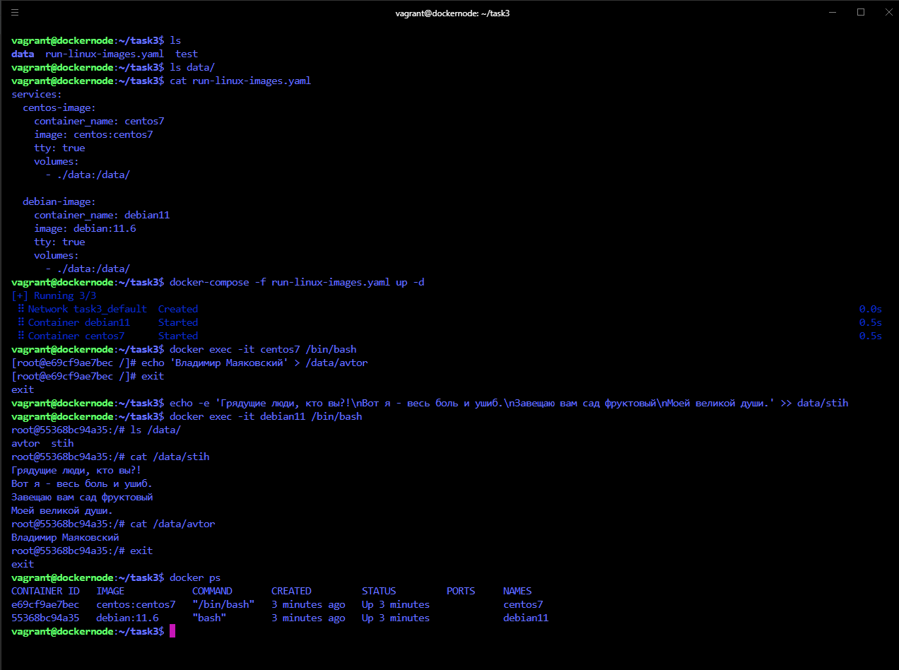

## Arsalan DEVOPS-24

### 5.3. Введение в Docker

####  Задача 1
Сценарий выполения задачи:
* создайте свой репозиторий на https://hub.docker.com;
* выберете любой образ, который содержит веб-сервер Nginx;
* создайте свой fork образа;
* реализуйте функциональность: запуск веб-сервера в фоне с индекс-страницей, содержащей HTML-код ниже:

```html
<html>
<head>
Hey, Netology
</head>
<body>
<h1>I’m DevOps Engineer!</h1>
</body>
</html>
```
<details>
<summary>Ответ</summary>

https://hub.docker.com/r/arstomorrow/nginx-task/tags
</details>


####  Задача 2
Посмотрите на сценарий ниже и ответьте на вопрос: "Подходит ли в этом сценарии использование Docker контейнеров или лучше подойдет виртуальная машина, физическая машина? Может быть возможны разные варианты?"

Детально опишите и обоснуйте свой выбор.

Сценарий:

* Высоконагруженное монолитное java веб-приложение;

    `Физический сервер или ВМ`
* Nodejs веб-приложение;

    `Docker`
* Мобильное приложение c версиями для Android и iOS;

    `Docker`
* Шина данных на базе Apache Kafka;

    `Виртуальная машина`
* Elasticsearch кластер для реализации логирования продуктивного веб-приложения - три ноды elasticsearch, два logstash и две ноды kibana;

    `Docker или вм`
* Мониторинг-стек на базе Prometheus и Grafana;

    `Docker`
* MongoDB, как основное хранилище данных для java-приложения;

    `Физический сервер или ВМ`
* Gitlab сервер для реализации CI/CD процессов и приватный (закрытый) Docker Registry.

    `Docker`

####  Задача 3

* Запустите первый контейнер из образа centos c любым тэгом в фоновом режиме, подключив папку /data из текущей рабочей директории на хостовой машине в /data контейнера;
* Запустите второй контейнер из образа debian в фоновом режиме, подключив папку /data из текущей рабочей директории на хостовой машине в /data контейнера;
* Подключитесь к первому контейнеру с помощью docker exec и создайте текстовый файл любого содержания в /data;
* Добавьте еще один файл в папку /data на хостовой машине;
* Подключитесь во второй контейнер и отобразите листинг и содержание файлов в /data контейнера

<details>
<summary>Ответ</summary>


</details>


####  Задача 4(*)
Воспроизвести практическую часть лекции самостоятельно.

Соберите Docker образ с Ansible, загрузите на Docker Hub и пришлите ссылку вместе с остальными ответами к задачам.
<details>
<summary>Ответ</summary>

https://hub.docker.com/r/arstomorrow/ansible-task
</details>