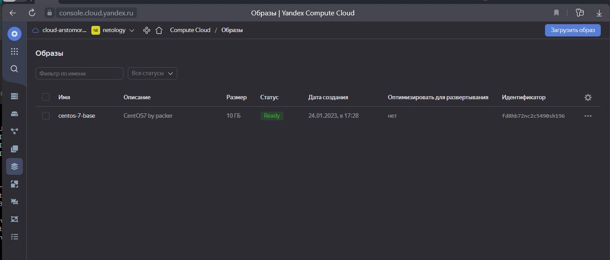
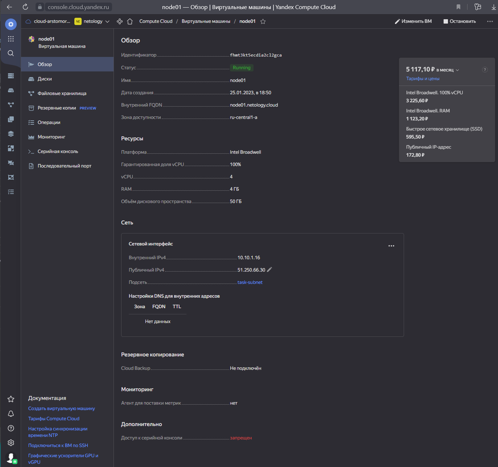
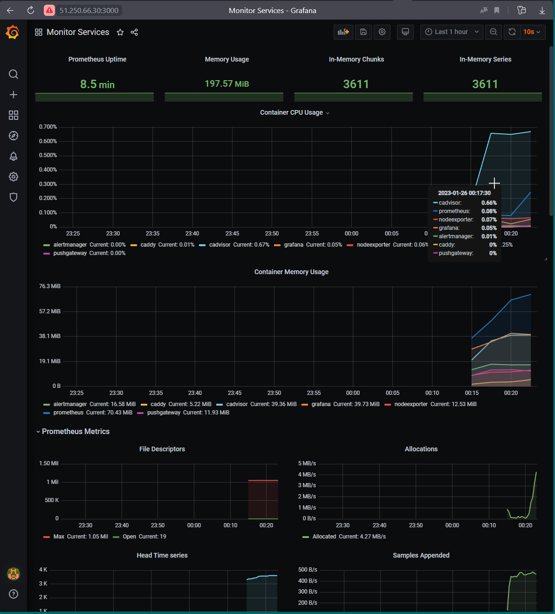
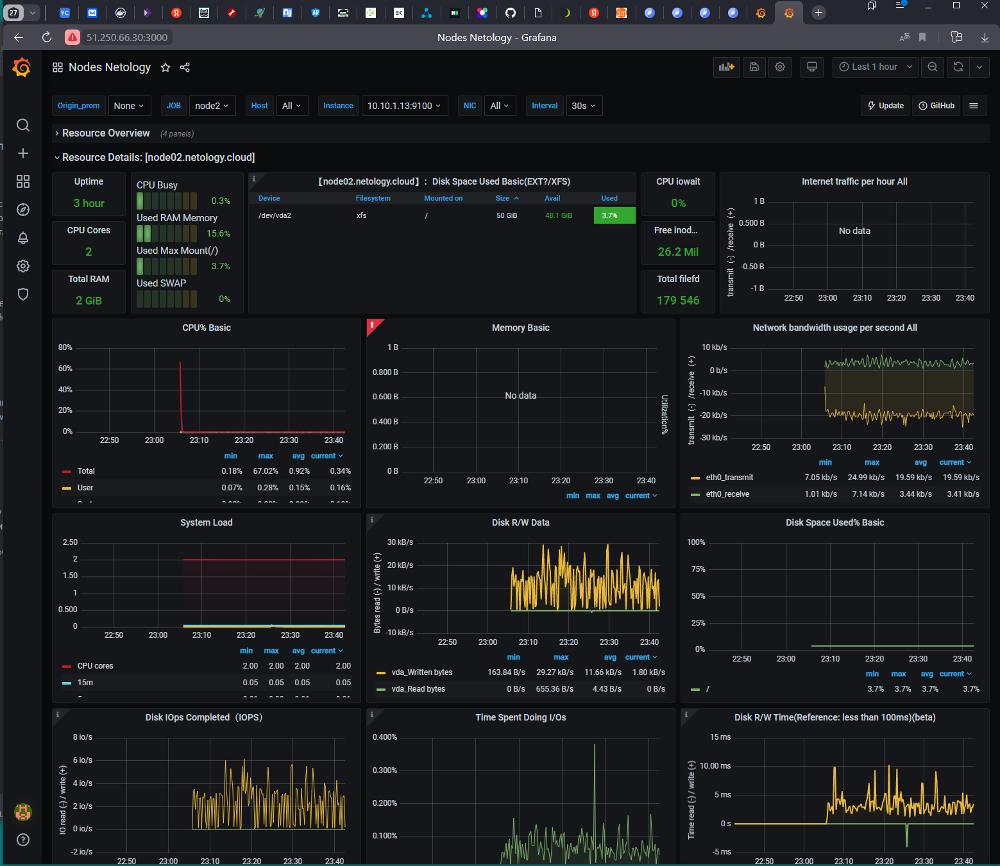

## Arsalan DEVOPS-24

### 5.4. Оркестрация группой Docker контейнеров на примере Docker Compose

####  Задача 1
Создать собственный образ любой операционной системы (например, centos-7) с помощью Packer.
Для получения зачета вам необходимо предоставить скриншот страницы с созданным образом из личного кабинета YandexCloud.

Ответ

####  Задача 2
Создать вашу первую виртуальную машину в YandexCloud.
Для получения зачета, вам необходимо предоставить cкриншот страницы свойств созданной ВМ из личного кабинета YandexCloud.

Ответ

####  Задача 3
Создать ваш первый готовый к боевой эксплуатации компонент мониторинга, состоящий из стека микросервисов.
Для получения зачета, вам необходимо предоставить:

Скриншот работающего веб-интерфейса Grafana с текущими метриками.

Ответ

####  Задача 4
Создать вторую ВМ и подключить её к мониторингу развёрнутому на первом сервере.
Для получения зачета, вам необходимо предоставить:

Скриншот из Grafana, на котором будут отображаться метрики добавленного вами сервера.

Ответ

