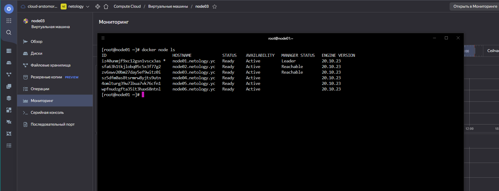

## Arsalan DEVOPS-24

### 5.5. Оркестрация кластером Docker контейнеров на примере Docker Swarm.

####  Задача 1.
* В чём отличие режимов работы сервисов в Docker Swarm кластере: replication и global?

    `В глобальном режиме,сервис будет развернута с одной репликой на каждом узле кластера. 
В реплицируемом режиме вы указываете количество одиноковых сервисов, которые хотите выполнять на каждом узле.`

* Какой алгоритм выбора лидера используется в Docker Swarm кластере?

    `Raft - любой из manager-узлов в любой момент времени может заменить leader-узел.`

* Что такое Overlay Network?

    `Создает внутреннюю частную сеть, которая охватывает все узлы, участвующие в кластере.`

####  Задача 2.
Создать ваш первый Docker Swarm кластер в Яндекс.Облаке

Для получения зачета, вам необходимо предоставить скриншот из терминала (консоли), с выводом команды:
`docker node ls`

Ответ

####  Задача 3.
Создать ваш первый, готовый к боевой эксплуатации кластер мониторинга, состоящий из стека микросервисов.

Для получения зачета, вам необходимо предоставить скриншот из терминала (консоли), с выводом команды:
`docker service ls`

Ответ

####  Задача 4.
Выполнить на лидере Docker Swarm кластера команду (указанную ниже) и дать письменное описание её функционала, что она делает и зачем она нужна:
`docker swarm update --autolock=true`

Ответ

Этот функционал шифрует логи и "секреты" в ноде, без ввода ключа невозможно вернуть ноду в кластер.  

