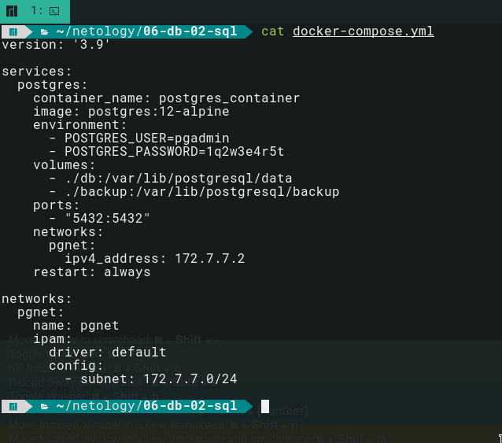

## Arsalan DEVOPS-24

### 6.2. SQL.

#### Задача 1
Используя docker поднимите инстанс PostgreSQL (версию 12) c 2 volume, в который будут складываться данные БД и бэкапы.

Приведите получившуюся команду или docker-compose манифест.

Ответ

